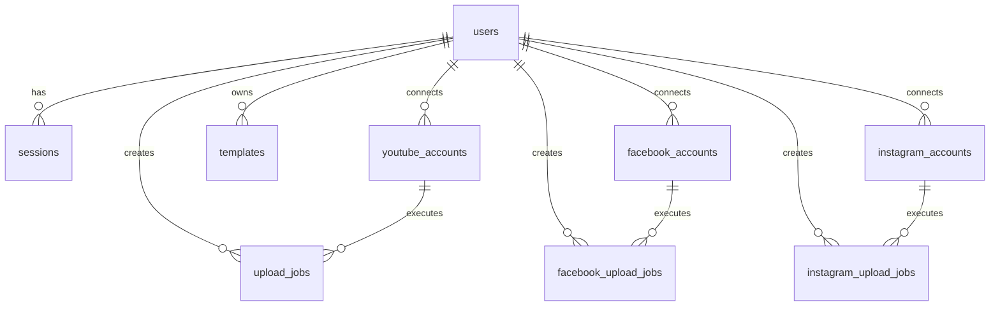

# 🎬 Local Video Clip Editor & Automation Studio

[](https://react.dev/)
[](https://vitejs.dev/)
[](https://tailwindcss.com/)
[](https://workers.cloudflare.com/)
[](https://developers.cloudflare.com/d1/)
[](https://hono.dev/)
[](https://www.backblaze.com/cloud-storage)
[](LICENSE)

> **A high-performance, privacy-first video editing and automated social publishing studio.**
> Edit, reframe, split, brand, enhance, and render short-form clips (YouTube Shorts, Facebook Reels, Instagram Reels, TikTok) **100% locally in your browser** using WebCodecs hardware acceleration, with seamless serverless scheduling and cloud-assisted publishing.

---

## 📑 Table of Contents

- [Key Highlights](#-key-highlights)
- [System Architecture](#-system-architecture)
- [Comprehensive Feature Breakdown](#-comprehensive-feature-breakdown)
  - [1. Local-First In-Browser Video Processing Engine](#1-local-first-in-browser-video-processing-engine)
  - [2. Timeline, Trimming & Precision Splitting](#2-timeline-trimming--precision-splitting)
  - [3. Dynamic Framing, Aspect Ratios & AI Face Centering](#3-dynamic-framing-aspect-ratios--ai-face-centering)
  - [4. Visual Effects & Background Backdrops](#4-visual-effects--background-backdrops)
  - [5. Typography, Dynamic Overlays & Watermarking](#5-typography-dynamic-overlays--watermarking)
  - [6. Advanced Multi-Track Audio Engine & Ducking](#6-advanced-multi-track-audio-engine--ducking)
  - [7. Studio Template Presets](#7-studio-template-presets)
  - [8. Multi-Platform Social Automation (YouTube, Facebook, Instagram)](#8-multi-platform-social-automation-youtube-facebook-instagram)
- [Project Directory Structure](#-project-directory-structure)
- [Database Schema (Cloudflare D1 SQLite)](#-database-schema-cloudflare-d1-sqlite)
- [Backend REST API Reference](#-backend-rest-api-reference)
- [Tech Stack Details](#-tech-stack-details)
- [Prerequisites & Environment Configuration](#-prerequisites--environment-configuration)
- [Local Development Setup](#-local-development-setup)
- [Production Deployment Guide](#-production-deployment-guide)
- [Security, Privacy & Performance Model](#-security-privacy--performance-model)
- [Troubleshooting & FAQs](#-troubleshooting--faqs)

---

## 🌟 Key Highlights

- **🔒 100% Zero-Upload Video Editing:** Source video files, frames, and audio tracks never touch external servers for editing. All decoding, rendering, transformation, and encoding occur locally in the client browser.
- **⚡ Hardware-Accelerated WebCodecs Pipeline:** Utilizes the native browser `VideoEncoder` API (H.264) paired with an internal zero-dependency MP4 Muxer for near-instant rendering, with automatic fallback to standard `MediaRecorder`.
- **✂️ Smart Batch Slicing:** Effortlessly slice long-form content into bite-sized clips by duration (e.g., 30s/60s chunks), equal parts, or custom manual split points.
- **🎯 Dynamic Dynamic Reframing:** Convert widescreen 16:9 content into 9:16 vertical shorts with smart AI Face Detection centering, blurred ambient video backdrops, or solid letterboxing.
- **🏷️ Token-Based Templating:** Automatically interpolate dynamic variables (`{movie}`, `{part}`, `{total}`, `{title}`) into video text overlays, YouTube video titles, tags, and social media captions.
- **📱 Direct Multi-Platform Distribution:** Connect Google/YouTube and Meta/Facebook/Instagram OAuth 2.0 accounts to publish directly or schedule queued releases across multiple channels.
- **☁️ Cloudflare Serverless Edge Backend:** Powered by Hono and Cloudflare D1 SQL for lightweight metadata management, multi-device auth sessions, Backblaze B2 temporary staging, and automated 5-minute cron schedulers.

---

## 🏗️ System Architecture

```
┌──────────────────────────────────────────────────────────────────────────────────────────┐
│                                   FRONTEND (React 19 + Vite)                             │
│                                                                                          │
│  ┌──────────────────────┐  ┌──────────────────────┐  ┌─────────────────────────────────┐ │
│  │   Timeline & Split   │  │   WYSIWYG Canvas     │  │      Export Engine              │ │
│  │   - Cut / Keep / Del │  │   - Video Blit       │  │  - WebCodecs VideoEncoder(H.264)│ │
│  │   - Part Generator   │  │   - Overlays & Logos │  │  - Offline Web Audio Mixer   │ │
│  │   - Live Cut-Skip    │  │   - WebGL Shaders    │  │  - In-Browser MP4 Muxer      │ │
│  └──────────────────────┘  └──────────────────────┘  └─────────────────────────────────┘ │
│                                                                                          │
│  ┌──────────────────────┐  ┌──────────────────────┐  ┌─────────────────────────────────┐ │
│  │  AI Face Tracking    │  │ Multi-Platform Panel │  │   Studio Template Presets       │ │
│  │  - Native FaceDetect │  │ - YouTube Shorts API │  │   - 1-Click Visual & Social     │ │
│  │  - Speaker Centering │  │ - Facebook / IG Reels│  │   - Dynamic Token Replacer      │ │
│  └──────────────────────┘  └──────────────────────┘  └─────────────────────────────────┘ │
└────────────────────────────────────────┬─────────────────────────────────────────────────┘
                                         │  HTTPS / REST / Secure Cookies / Bearer Auth
┌────────────────────────────────────────▼─────────────────────────────────────────────────┐
│                           BACKEND (Cloudflare Worker + Hono)                             │
│                                                                                          │
│  ├── /api/auth/*         -> Multi-device auth, salted PBKDF2 hashing, session cookies   │
│  ├── /api/youtube/*      -> Google OAuth 2.0, Channel Info, Token Exchange, Auto-Tags    │
│  ├── /api/facebook/*     -> Meta Graph API v26.0, Page Tokens, Reels Direct/Schedule     │
│  ├── /api/instagram/*    -> Instagram Creator/Business Graph API, Container Publisher    │
│  ├── /api/storage/*      -> Backblaze B2 Authorized Bridge & Signed URLs                 │
│  ├── /api/templates/*    -> Cloud sync for branding & configuration presets              │
│  ├── /api/admin/*        -> Audit logs, scope purges, and automated factory reset        │
│  └── Cron Trigger        -> Runs every 5 mins: Executes scheduled posts & cleans B2 temp │
└───────────────────┬───────────────────────────────────────────────┬──────────────────────┘
                    │                                               │
┌───────────────────▼──────────────────────┐   ┌────────────────────▼─────────────────────┐
│       DATABASE (Cloudflare D1 SQL)       │   │        CLOUD STORAGE (Backblaze B2)      │
│  - users & sessions                      │   │  - Temporary bridge for Meta Ingestion   │
│  - youtube_accounts & upload_jobs        │   │  - Signed ephemeral download links       │
│  - facebook_accounts & upload_jobs       │   │  - Auto-purged after successful publish  │
│  - instagram_accounts & upload_jobs      │   │  - Auto-cleaned by 5-min Worker Cron     │
│  - studio templates & audit logs         │   └──────────────────────────────────────────┘
└──────────────────────────────────────────┘
```

---

## 🚀 Comprehensive Feature Breakdown

### 1. Local-First In-Browser Video Processing Engine
- **WebCodecs Hardware Pipeline:** Leverages the native browser `VideoEncoder` and `VideoFrame` APIs for hardware-accelerated H.264 encoding directly on your GPU/CPU.
- **Custom In-Memory MP4 Muxer (`mp4Muxer.js`):** Built-in zero-dependency ISOBMFF box writer (`ftyp`, `moov`, `trak`, `mdia`, `minf`, `stbl`, `mdat`) that writes fast-start MP4 containers in real-time.
- **Graceful MediaRecorder Fallback:** Seamlessly detects browser capabilities and switches to a canvas stream recorder if WebCodecs is unsupported.
- **Hardware & Concurrency Budgeting:** Detects available CPU cores and memory via `capabilityDetector.js` to prevent UI freezing and optimize parallel rendering jobs.

### 2. Timeline, Trimming & Precision Splitting
- **Interactive Multi-Segment Timeline:** Visual playhead scrubber, zoom levels, millisecond-precision In/Out trim markers.
- **Multiple Splitting Modes:**
  - *Fixed Duration:* Split video automatically into 15s, 30s, 60s, or custom duration parts.
  - *Equal Parts:* Evenly partition the selected timeline range into $N$ equal clips.
  - *Manual Cut Points:* Add arbitrary split points anywhere along the timeline.
- **Keep/Delete Cut Segments:** Mark unwanted sections to be cut out. The live preview engine automatically skips cut ranges during playback.
- **Interactive Parts Table:** Re-order, preview, name, and manage generated clip ranges before rendering.

### 3. Dynamic Framing, Aspect Ratios & AI Face Centering
- **Aspect Ratio Presets:** 9:16 (Shorts/Reels/TikTok), 16:9 (Landscape), 1:1 (Square), 4:5 (Portrait), 21:9 (Cinematic), and custom dimension ratios.
- **Framing Controls:** Fit (letterbox), Fill (crop), Zoom ($1\times$ to $3\times$), and 2D pan offset ($X/Y$ shifting).
- **AI-Powered Face Tracking (`faceDetectionService.js`):** Utilizes native browser `FaceDetector` API or heuristic facial positioning algorithms to detect active subjects and keep them centered in vertical crops.

### 4. Visual Effects & Background Backdrops
- **Ambient Blurred Backdrops:** Fill letterbox gaps with an enlarged, blurred duplicate of the source video with configurable blur radius ($0\text{--}50\text{px}$) and opacity ($0\text{--}100\%$).
- **Solid Colors & Custom Images:** Set hex color backgrounds or upload custom branded background wallpapers.
- **GPU-Accelerated WebGL Shader Pipeline (`webglEffectsPipeline.js`):**
  - Brightness, Contrast, Saturation
  - Hue Rotation, Invert, Sepia, Vignette, Sharpness

### 5. Typography, Dynamic Overlays & Watermarking
- **Draggable Text Overlays:** Place multiple text layers with custom X/Y positioning or preset snap points (Top-Center, Bottom-Center, etc.).
- **Dynamic Variable Interpolation:** Real-time token substitution:
  - `{movie}` $\rightarrow$ Movie or Series Name
  - `{part}` $\rightarrow$ Sequential Part Number (e.g., `1`, `2`)
  - `{total}` $\rightarrow$ Total Generated Parts count
  - Padded numbering format (e.g., `Part 01`, `Part 02`).
- **Rich Text Styling:** Custom font family, font size, text color, stroke outline with customizable thickness/color, rounded background pill boxes, and drop shadows.
- **Logo & Watermark Engine:** Upload brand logos, adjust scale, opacity, padding, and anchor position.

### 6. Advanced Multi-Track Audio Engine & Ducking
- **Web Audio API Graph (`audioEngine.js`):** Offline audio rendering graph for precise sample-rate synchronization.
- **Multi-Track Mixing:** Blend original video audio with supplementary background music or voiceover tracks.
- **Smart Voice Ducking:** Automatically detects speech frequencies in voiceover tracks and reduces background music volume proportionally.
- **Pitch-Preserving Resampling:** Maintain audio fidelity across varying playback rates and frame rates.

### 7. Studio Template Presets
- **1-Click Studio Profiles:** Save all aspect ratios, framing modes, text overlay positions, color schemes, logo configurations, and social media metadata templates as reusable presets.
- **Cloud & Local Sync:** Save presets locally or sync them to Cloudflare D1 for access across all your devices.

### 8. Multi-Platform Social Automation (YouTube, Facebook, Instagram)
- **YouTube Shorts & Videos:**
  - Google OAuth 2.0 with secure refresh token management.
  - Direct Resumable Upload Session initialization (video uploads direct from client browser to YouTube servers—bypassing worker byte limits).
  - Configurable metadata: Title, Description, Tags, Category, Audience (Made for Kids), and Visibility (Public, Unlisted, Private).
  - Automated scheduling queue with custom interval offsets (e.g., publish a clip every 2 hours).
- **Facebook Reels & Page Videos:**
  - Meta Graph API v26.0 OAuth with Page Access Token auto-exchange.
  - Multi-page selector for managing multiple Facebook Pages.
  - Direct posting or scheduled posting via transient Backblaze B2 staging bridge.
- **Instagram Reels & Feed:**
  - Meta Graph API Instagram Business / Creator integration.
  - Container initialization, status polling, and automatic publishing.
- **Automated 5-Minute Cron Engine:** Cloudflare Worker cron worker periodically polls pending scheduled jobs, triggers Meta API publishing, and purges temporary B2 files.

---

## 📁 Project Directory Structure

```
local-video-clip-editor/
├── backend/                              # Cloudflare Worker Serverless Backend
│   ├── migrations/                       # D1 Database SQL Migrations
│   ├── src/
│   │   ├── auth.js                       # Google OAuth 2.0 & Session token routines
│   │   ├── b2.js                         # Backblaze B2 S3 API client & presigned URLs
│   │   ├── crypto.js                     # Password hashing, PBKDF2, AES encryption
│   │   ├── db.js                         # D1 SQLite queries & typed CRUD helpers
│   │   ├── facebook.js                   # Meta Graph API v26.0 Facebook Page & Reels client
│   │   ├── instagram.js                  # Meta Graph API Instagram Business/Creator client
│   │   ├── youtube.js                    # YouTube Data API v3 resumable upload sessions
│   │   └── index.js                      # Hono App, REST Router, and Cron Scheduled Handlers
│   ├── .dev.vars.example                 # Backend environment secrets template
│   ├── package.json                      # Backend dependencies (Hono, Wrangler)
│   ├── reset.sql                         # Database reset / purge script
│   ├── schema.sql                        # Full D1 database schema definitions
│   └── wrangler.toml                     # Cloudflare Worker configuration & D1 bindings
│
├── frontend/                             # React 19 + Vite Client Application
│   ├── public/                           # Static assets and icons
│   ├── src/
│   │   ├── components/
│   │   │   ├── AudioPanel.jsx            # Multi-track audio mixer & voice ducking controls
│   │   │   ├── AuthModal.jsx             # User login, registration, and session modal
│   │   │   ├── BackgroundEditor.jsx      # Video blur backdrop, color, and canvas settings
│   │   │   ├── CropEditor.jsx            # Aspect ratios, crop coordinates & face tracking
│   │   │   ├── EditorTabs.jsx            # Main tabbed control navigation
│   │   │   ├── EffectsPanel.jsx          # WebGL shader filter adjustments
│   │   │   ├── ExportPanel.jsx           # Render resolution, bitrate, format, and batch export
│   │   │   ├── FacebookPanel.jsx         # Facebook Page selector, copy & scheduling
│   │   │   ├── GeneratedClips.jsx        # Output gallery, video preview, and ZIP export
│   │   │   ├── Header.jsx                # Header bar, video metadata info, and profile status
│   │   │   ├── InstagramPanel.jsx        # Instagram Creator selector, copy & scheduling
│   │   │   ├── LogoEditor.jsx            # Watermark branding, opacity, and positioning
│   │   │   ├── ProcessingQueue.jsx       # Batch rendering queue & hardware worker stats
│   │   │   ├── SplitCutEditor.jsx        # Duration/parts splitters, cut ranges, parts table
│   │   │   ├── StoragePanel.jsx          # Backblaze B2 storage usage and cleanup stats
│   │   │   ├── StorageSettingsModal.jsx  # Cloud storage & GDPR purge modal
│   │   │   ├── TemplateManagerModal.jsx  # Studio template presets manager
│   │   │   ├── TextEditor.jsx            # Typography, token replacement, and text layers
│   │   │   ├── Timeline.jsx              # Interactive multi-track timeline & cut-skipping
│   │   │   ├── VideoPreview.jsx          # Real-time WYSIWYG canvas renderer
│   │   │   ├── VideoUploader.jsx         # Drag-and-drop video upload & metadata probe
│   │   │   ├── YouTubePanel.jsx          # YouTube upload metadata & scheduler
│   │   │   ├── YouTubeScheduleModal.jsx  # Bulk scheduling interval modal
│   │   │   └── YouTubeUploadHistory.jsx  # YouTube upload job audit logs & statuses
│   │   ├── context/
│   │   │   └── ToastContext.jsx          # Global notification toast provider
│   │   ├── hooks/
│   │   │   ├── useAuth.js                # Auth state, login/logout, and session sync
│   │   │   ├── useFacebook.js            # Facebook accounts and scheduled jobs hook
│   │   │   ├── useInstagram.js           # Instagram accounts and scheduled jobs hook
│   │   │   ├── useProcessingQueue.js     # Rendering queue and worker dispatcher
│   │   │   ├── useTemplates.js           # Studio template presets hook
│   │   │   ├── useUploadQueue.js         # Social media upload orchestration
│   │   │   └── useYouTube.js             # YouTube channel and upload jobs hook
│   │   ├── services/
│   │   │   ├── apiService.js             # Client API wrapper for Cloudflare Worker
│   │   │   ├── audioEngine.js            # Web Audio API mixer & offline audio graph
│   │   │   ├── capabilityDetector.js     # Hardware, WebCodecs & CPU core detector
│   │   │   ├── exportEngine.js           # Main export coordinator (WebCodecs & MediaRecorder)
│   │   │   ├── faceDetectionService.js   # Browser-side AI face detection
│   │   │   ├── mp4Muxer.js               # Zero-dependency in-browser MP4 container muxer
│   │   │   ├── sharedUploadCache.js      # Session & upload state cache
│   │   │   ├── videoProcessingEngine.js  # Frame-by-frame transformation engine
│   │   │   ├── webglEffectsPipeline.js   # WebGL 2.0 shader filters
│   │   │   └── zipService.js             # JSZip batch packaging utility
│   │   ├── utils/
│   │   │   ├── crop.js                   # Aspect ratio math and bounding box calculations
│   │   │   ├── filename.js               # Output file naming with token substitution
│   │   │   ├── mediaDetector.js          # Codec & video container inspection
│   │   │   ├── scheduler.js              # Timestamp intervals and timezone formatters
│   │   │   ├── time.js                   # Timecode formatters (HH:MM:SS.mmm)
│   │   │   └── titleCleaner.js           # Video title formatting and cleanup
│   │   ├── App.jsx                       # Main application state and layout
│   │   ├── index.css                     # Tailwind CSS imports & global styles
│   │   └── main.jsx                      # React 19 application root
│   ├── .env.example                      # Frontend environment template
│   ├── package.json                      # Frontend dependencies
│   ├── tsconfig.json                     # TypeScript configuration
│   ├── vite.config.ts                    # Vite build & development proxy configuration
│   └── wrangler.jsonc                    # Cloudflare Pages / Workers deployment config
│
├── package.json                          # Workspace root management scripts
├── README.md                             # Full Project Documentation
└── architecture.txt                      # Architecture & Deployment Reference
```

---

## 🗄️ Database Schema (Cloudflare D1 SQLite)

The database schema is defined in [`backend/schema.sql`](file:///e:/local-video-clip-editor/backend/schema.sql) and contains 9 relational tables:



### Table Details:
1. **`users`**: User identity, unique email, salted password hash, salt, and timestamp audit logs.
2. **`sessions`**: Multi-device session tokens with expiry timestamps (`expires_at`).
3. **`youtube_accounts`**: Google OAuth 2.0 credentials (access token, refresh token, expiry), channel ID, title, handle, and thumbnail.
4. **`upload_jobs`**: YouTube upload tracking, video ID, part numbers, titles, descriptions, tags, categories, Made for Kids flags, visibility, and publish schedules.
5. **`templates`**: Cross-section studio presets storing JSON payloads for text styling, logo config, YouTube templates, Facebook copy, and Instagram hashtags.
6. **`facebook_accounts`**: Meta OAuth credentials, user ID, managed Facebook Pages list, selected Page ID, page name, and Page Access Tokens.
7. **`facebook_upload_jobs`**: Facebook Reels / Video publishing logs, scheduled publish times, status (`pending`, `uploading`, `published`, `failed`), and Backblaze B2 file references.
8. **`instagram_accounts`**: Instagram Business/Creator metadata, IG User ID, username, profile picture, and long-lived access tokens.
9. **`instagram_upload_jobs`**: Instagram Reels publishing logs, container IDs, media IDs, permalinks, and publish schedules.

---

## 🌐 Backend REST API Reference

All backend endpoints are routed through Cloudflare Workers using the Hono framework:

### 1. Authentication (`/api/auth/*`)
| Method | Endpoint | Description |
|---|---|---|
| `POST` | `/api/auth/signup` | Create a new user account with salted password hash |
| `POST` | `/api/auth/login` | Authenticate credentials and issue session token / cookie |
| `POST` | `/api/auth/logout` | Revoke active session token |
| `GET` | `/api/auth/me` | Fetch authenticated user profile and active connected accounts |

### 2. YouTube OAuth & Uploads (`/api/youtube/*`, `/api/uploads/*`)
| Method | Endpoint | Description |
|---|---|---|
| `GET` | `/api/youtube/auth-url` | Generate Google OAuth 2.0 consent URL |
| `GET` | `/api/youtube/callback` | OAuth redirect callback; exchanges code for tokens |
| `GET` | `/api/youtube/status` | Fetch connected YouTube channel status and permissions |
| `POST` | `/api/youtube/disconnect` | Revoke YouTube authorization and delete account record |
| `POST` | `/api/uploads/create-resumable-session` | Initialize direct YouTube Resumable Upload session |
| `POST` | `/api/uploads/record-job` | Create a new upload job tracking record in D1 |
| `GET` | `/api/uploads/jobs` | List user YouTube upload jobs with pagination and statuses |
| `PATCH` | `/api/uploads/jobs/:id` | Update upload job status, video ID, or error message |

### 3. Facebook Meta Graph API (`/api/facebook/*`)
| Method | Endpoint | Description |
|---|---|---|
| `GET` | `/api/facebook/auth-url` | Generate Meta OAuth URL with Page management scopes |
| `GET` | `/api/facebook/callback` | Exchange OAuth code for long-lived User & Page tokens |
| `GET` | `/api/facebook/status` | Get connected Facebook account and managed Pages list |
| `POST` | `/api/facebook/select-page` | Switch active target Facebook Page for publishing |
| `POST` | `/api/facebook/disconnect` | Disconnect Facebook account and clear credentials |
| `POST` | `/api/facebook/publish-reel` | Publish a Facebook Reel via B2 transient bridge URL |
| `GET` | `/api/facebook/jobs` | Fetch Facebook publishing history and scheduled queue |

### 4. Instagram Graph API (`/api/instagram/*`)
| Method | Endpoint | Description |
|---|---|---|
| `GET` | `/api/instagram/auth-url` | Generate Meta OAuth URL with Instagram Business scopes |
| `GET` | `/api/instagram/callback` | Exchange OAuth code for Instagram Creator access tokens |
| `GET` | `/api/instagram/status` | Fetch linked Instagram Creator / Business accounts |
| `POST` | `/api/instagram/select-account` | Set active Instagram destination account |
| `POST` | `/api/instagram/disconnect` | Disconnect Instagram integration |
| `POST` | `/api/instagram/publish-reel` | Initialize container and publish Instagram Reel |
| `GET` | `/api/instagram/jobs` | List Instagram post history and scheduled queue |

### 5. Backblaze B2 Storage Bridge (`/api/storage/*`)
| Method | Endpoint | Description |
|---|---|---|
| `GET` | `/api/storage/b2-upload-url` | Obtain presigned B2 upload URL and token for video upload |
| `POST` | `/api/storage/b2-delete` | Immediately delete temporary video file from B2 bucket |
| `GET` | `/api/storage/stats` | View B2 storage utilization and temporary file count |

### 6. Studio Templates (`/api/templates/*`)
| Method | Endpoint | Description |
|---|---|---|
| `GET` | `/api/templates` | List all saved studio branding and metadata templates |
| `POST` | `/api/templates` | Create a new studio template preset |
| `PUT` | `/api/templates/:id` | Update an existing studio template preset |
| `DELETE` | `/api/templates/:id` | Delete a studio template preset |

### 7. User Data & Admin Tools (`/api/user/*`, `/api/admin/*`)
| Method | Endpoint | Description |
|---|---|---|
| `GET` | `/api/user/stats` | Retrieve aggregate storage, job counts, and quota usage |
| `POST` | `/api/user/clear-data` | Clear user jobs or templates by scope (`jobs`, `templates`, `all`) |
| `POST` | `/api/admin/run-cleanup` | Manually trigger temporary file purge and database cleanup |

---

## 🛠️ Tech Stack Details

### Frontend Architecture
- **Framework:** React 19 (`react`, `react-dom`)
- **Build Tool:** Vite 6
- **Styling:** Tailwind CSS v4 + Lucide React Icons
- **Video & Graphics APIs:** WebCodecs API (`VideoEncoder`, `VideoFrame`), WebGL / WebGL 2.0 Shader Pipeline, Canvas 2D Blitting
- **Audio Engineering:** Web Audio API (`AudioContext`, `OfflineAudioContext`, `GainNode`, `DynamicsCompressorNode`)
- **Container Packaging:** Zero-Dependency MP4 Muxer (`mp4Muxer.js`) + JSZip (batch exports)
- **Animation:** Motion (`motion`)

### Backend Architecture
- **Runtime:** Cloudflare Workers (V8 Serverless Edge Engine)
- **Framework:** Hono v4 (Ultra-lightweight web standards router)
- **Database:** Cloudflare D1 (Serverless Distributed SQLite)
- **Object Storage:** Backblaze B2 (S3-compatible temporary bridge)
- **External Integrations:**
  - Google OAuth 2.0 & YouTube Data API v3
  - Meta Graph API v26.0 (Facebook Pages & Instagram Business)

---

## ⚙️ Prerequisites & Environment Configuration

### Prerequisites
- **Node.js:** v18.0.0 or higher
- **Package Manager:** npm (v9+) or Bun / pnpm
- **Cloudflare Account:** For Cloudflare Workers and D1 Database
- **Wrangler CLI:** `npm install -g wrangler` or via `npx wrangler`
- **Google Cloud Console App:** (For YouTube Data API v3 OAuth)
- **Meta for Developers App:** (For Facebook Pages & Instagram Graph API)
- **Backblaze B2 Account:** (For temporary social media video bridging)

---

### Environment Variables Setup

#### 1. Backend Configuration (`backend/wrangler.toml` & Secrets)

Create `backend/.dev.vars` for local secrets and update `backend/wrangler.toml`:

```toml
# backend/wrangler.toml
name = "local-video-clip-editor-worker"
main = "src/index.js"
compatibility_date = "2024-09-23"
compatibility_flags = ["nodejs_compat"]

[[d1_databases]]
binding = "DB"
database_name = "videoclip-db"
database_id = "your-d1-database-id"
migrations_dir = "migrations"

[vars]
GOOGLE_CLIENT_ID = "your-google-client-id.apps.googleusercontent.com"
APP_URL = "http://localhost:8787"                # Worker URL (or production worker URL)
FRONTEND_URL = "http://localhost:5173"           # Frontend URL (or production pages URL)
FACEBOOK_APP_ID = "your-facebook-app-id"
META_GRAPH_API_VERSION = "v26.0"
B2_BUCKET_NAME = "your-b2-bucket-name"
B2_BUCKET_ID = "your-b2-bucket-id"

[triggers]
crons = ["*/5 * * * *"]                          # Scheduled worker every 5 minutes
```

Set secret environment variables in `backend/.dev.vars` (for local development):
```ini
# backend/.dev.vars
GOOGLE_CLIENT_SECRET="your-google-client-secret"
FACEBOOK_APP_SECRET="your-facebook-app-secret"
B2_KEY_ID="your-backblaze-key-id"
B2_APPLICATION_KEY="your-backblaze-application-key"
```

For production deployment, add these secrets to Cloudflare:
```bash
npx wrangler secret put GOOGLE_CLIENT_SECRET
npx wrangler secret put FACEBOOK_APP_SECRET
npx wrangler secret put B2_KEY_ID
npx wrangler secret put B2_APPLICATION_KEY
```

#### 2. Frontend Configuration (`frontend/.env`)

Create `frontend/.env`:
```ini
# frontend/.env
# Leave blank during local development to use the Vite proxy,
# or set to your deployed Cloudflare Worker URL in production.
VITE_API_URL="https://local-video-clip-editor-worker.yourname.workers.dev"
```

---

## 💻 Local Development Setup

### 1. Clone & Install Dependencies

```bash
# Clone the repository
git clone https://github.com/Abhishek-64/local-video-clip-editor.git
cd local-video-clip-editor

# Install root, frontend, and backend packages
npm install
cd frontend && npm install && cd ..
cd backend && npm install && cd ..
```

### 2. Initialize the Local SQLite Database

Execute the schema against the local Cloudflare D1 environment:

```bash
# From the project root:
npm run db:execute:local

# Or directly from backend:
cd backend
npx wrangler d1 execute videoclip-db --local --file=schema.sql -c wrangler.toml
```

### 3. Start Development Servers

You can run both servers concurrently or in separate terminal tabs:

**Terminal 1 (Backend Cloudflare Worker):**
```bash
npm run dev:backend
# Starts Hono server at http://localhost:8787
```

**Terminal 2 (Frontend React App):**
```bash
npm run dev:frontend
# Starts Vite at http://localhost:5173 with API proxying
```

Open [http://localhost:5173](http://localhost:5173) in Chrome or Edge (recommended for WebCodecs hardware acceleration).

---

## 🚢 Production Deployment Guide

### Step 1: Deploy Database Schema to Cloudflare D1

```bash
# 1. Create a remote D1 database if not already created
npx wrangler d1 create videoclip-db

# 2. Update backend/wrangler.toml with the returned database_id

# 3. Apply schema.sql to the remote production database
npm run db:execute:remote
```

### Step 2: Deploy Backend Worker

```bash
cd backend
# Set your production secrets:
npx wrangler secret put GOOGLE_CLIENT_SECRET
npx wrangler secret put FACEBOOK_APP_SECRET
npx wrangler secret put B2_KEY_ID
npx wrangler secret put B2_APPLICATION_KEY

# Deploy worker
npm run deploy
```

### Step 3: Deploy Frontend (Cloudflare Pages / Workers)

```bash
cd frontend
# Build the production bundle
npm run build

# Deploy via Wrangler
npm run deploy
```

Or deploy both with a single command from root:
```bash
npm run deploy:all
```

---

## 🛡️ Security, Privacy & Performance Model

1. **Client-Side Video Isolation:**
   Video content is processed purely in the browser memory (`Blob`, `ArrayBuffer`, `VideoFrame`). Video bytes are never uploaded to the backend server for processing.
2. **Ephemeral Cloud Storage Lifecycle:**
   When publishing to Facebook Reels or Instagram, video files are uploaded directly to Backblaze B2 using short-lived signed URLs. Once the Meta Graph API downloads the container, the file is immediately purged. Any uncollected files are automatically cleaned by the 5-minute Cloudflare cron trigger.
3. **Password Hashing & Token Security:**
   User passwords are encrypted with cryptographically secure PBKDF2/SHA-256 with unique per-user salts. Google and Meta refresh tokens are encrypted and kept strictly in D1—they are never exposed to the client.
4. **Hardware Concurrency Protection:**
   The client-side export queue inspects `navigator.hardwareConcurrency` and caps active renders to prevent browser tab crashes and memory starvation.

---

## ❓ Troubleshooting & FAQs

#### Q: Why is export falling back to MediaRecorder instead of WebCodecs?
> **A:** WebCodecs (`VideoEncoder`) requires a secure context (`https://` or `localhost`) and browser support. Ensure hardware acceleration is enabled in your browser settings (`chrome://settings/system` $\rightarrow$ *Use graphics acceleration when available*).

#### Q: How do template tokens work?
> **A:** When naming clips or text overlays, use `{movie}`, `{part}`, `{total}`, or `{title}`. During batch rendering or upload generation, the editor automatically replaces these tokens with real values (e.g., `Part 1`, `Part 2`).

#### Q: Can I run this completely offline without the backend?
> **A:** **Yes!** All video editing, cutting, text overlays, logo watermarks, effects, audio mixing, and MP4 rendering operate 100% locally. The backend is only required for cloud template sync, user accounts, and direct YouTube/Meta social publishing.

---

## 📄 License

This project is licensed under the [MIT License](LICENSE).
