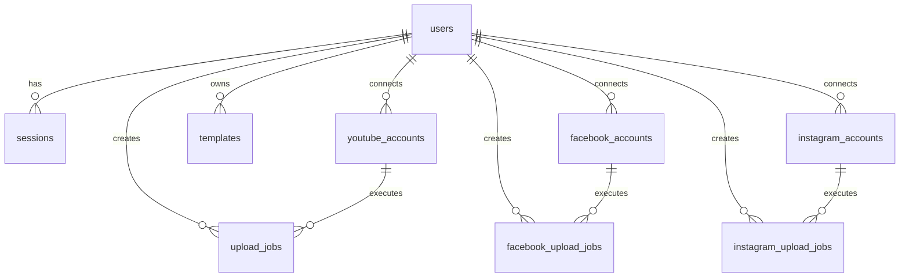

# 🎬 Local Video Clip Editor & Social Publishing Automation Studio

[](https://react.dev/)
[](https://vitejs.dev/)
[](https://tailwindcss.com/)
[](https://workers.cloudflare.com/)
[](https://developers.cloudflare.com/d1/)
[](https://hono.dev/)
[](https://www.backblaze.com/cloud-storage)
[](LICENSE)

> **A high-performance, privacy-first local video editing, reframing, and multi-platform automated social publishing studio.**
> Edit, reframe, split, brand, enhance, and render clips **100% locally in your browser** using WebCodecs hardware acceleration, with serverless scheduled publishing for **YouTube Shorts**, **Facebook Reels**, and **Instagram Reels**.

---

## 📑 Table of Contents

- [🌟 Project Overview & Core Philosophy](#-project-overview--core-philosophy)
- [🏗️ High-Level System Architecture](#️-high-level-system-architecture)
- [⚡ In-Browser Video Processing Engine](#-in-browser-video-processing-engine)
  - [Hardware-Accelerated WebCodecs & MP4 Muxer](#hardware-accelerated-webcodecs--mp4-muxer)
  - [Web Worker Offloading (`exportWorker.js`)](#web-worker-offloading-exportworkerjs)
  - [Memory Optimization: The Nulled-Blob Strategy](#memory-optimization-the-nulled-blob-strategy)
  - [Timeline, Non-Destructive Slicing & Cut Preservation](#timeline-non-destructive-slicing--cut-preservation)
  - [Dynamic Framing & Browser-Native AI Face Centering](#dynamic-framing--browser-native-ai-face-centering)
  - [Typography, Dynamic Part Tokens & Watermarking](#typography-dynamic-part-tokens--watermarking)
  - [Multi-Track Web Audio Mixing & Voice Ducking](#multi-track-web-audio-mixing--voice-ducking)
- [🌐 Multi-Platform Social Automation Engine](#-multi-platform-social-automation-engine)
  - [YouTube Shorts & Videos Pipeline](#youtube-shorts--videos-pipeline)
  - [Facebook Reels & Page Videos Pipeline](#facebook-reels--page-videos-pipeline)
  - [Instagram Reels & Stories Pipeline](#instagram-reels--stories-pipeline)
  - [Unified Multi-Platform Publish Modal (`UnifiedPublishModal.jsx`)](#unified-multi-platform-publish-modal-unifiedpublishmodaljsx)
  - [Photo Mode Publishing](#photo-mode-publishing)
- [📦 The Backblaze B2 Ephemeral Staging Bridge](#-the-backblaze-b2-ephemeral-staging-bridge)
  - [Why an Ephemeral Storage Bridge is Required](#why-an-ephemeral-storage-bridge-is-required)
  - [In-Memory Deduplication (`sharedUploadCache.js`)](#in-memory-deduplication-shareduploadcachejs)
  - [Mutual Retention & The `retainB2` Architecture](#mutual-retention--the-retainb2-architecture)
  - [Pre-Flight HEAD Check & Instant 404 Detection](#pre-flight-head-check--instant-404-detection)
  - [Client-Side Auto-Recovery & Zero-Friction Re-Upload](#client-side-auto-recovery--zero-friction-re-upload)
  - [B2 522 / 429 Transient Retry Engine with Exponential Backoff](#b2-522--429-transient-retry-engine-with-exponential-backoff)
- [📁 Comprehensive Directory & File Structure](#-comprehensive-directory--file-structure)
- [🗄️ Database Schema & Lifecycle (Cloudflare D1 SQLite)](#️-database-schema--lifecycle-cloudflare-d1-sqlite)
- [🌐 Complete REST API Reference](#-complete-rest-api-reference)
  - [1. Authentication & Session Management](#1-authentication--session-management)
  - [2. YouTube Data API v3](#2-youtube-data-api-v3)
  - [3. Facebook Meta Graph API v26.0](#3-facebook-meta-graph-api-v260)
  - [4. Instagram Graph API v26.0](#4-instagram-graph-api-v260)
  - [5. Unified Social Scheduling & Upload History](#5-unified-social-scheduling--upload-history)
  - [6. Studio Templates Presets](#6-studio-templates-presets)
  - [7. Backblaze B2 Storage & Database Cleanup](#7-backblaze-b2-storage--database-cleanup)
  - [8. Scheduler Triggers & Administrative Cron](#8-scheduler-triggers--administrative-cron)
- [⚙️ Environment Configuration & Deployment](#️-environment-configuration--deployment)
  - [Prerequisites](#prerequisites)
  - [Backend Secrets & Variables (`backend/wrangler.toml`)](#backend-secrets--variables-backendwranglertoml)
  - [Frontend Variables (`frontend/.env`)](#frontend-variables-frontendenv)
  - [Local Development Instructions](#local-development-instructions)
  - [Cloudflare Production Deployment Guide](#cloudflare-production-deployment-guide)
- [🧪 Automated Test Suites](#-automated-test-suites)
- [🧠 AI Reference & Developer Troubleshooting Guide](#-ai-reference--developer-troubleshooting-guide)
  - [Gotcha 1: Meta Error 2207076 ("Media upload has failed")](#gotcha-1-meta-error-2207076-media-upload-has-failed)
  - [Gotcha 2: Cloudflare HTTP 522 with Backblaze B2](#gotcha-2-cloudflare-http-522-with-backblaze-b2)
  - [Gotcha 3: Stale `sessionStorage` Upload References](#gotcha-3-stale-sessionstorage-upload-references)
  - [Gotcha 4: Browser Heap Exhaustion with Large Video Blobs](#gotcha-4-browser-heap-exhaustion-with-large-video-blobs)
  - [Gotcha 5: Facebook Cleanup Race Condition in Dual-Publishing](#gotcha-5-facebook-cleanup-race-condition-in-dual-publishing)
- [📄 License](#-license)

---

## 🌟 Project Overview & Core Philosophy

The **Local Video Clip Editor** is an end-to-end video production suite designed to solve three major challenges in modern content creation:
1. **Privacy & Heavy Cloud Rendering Costs:** Traditional web video editors upload full gigabyte-sized raw video files to cloud servers for rendering, resulting in massive bandwidth overhead, queue delays, and privacy concerns. This application executes **100% of video decoding, canvas transforming, audio mixing, and H.264 encoding directly in the user's browser** via the native `WebCodecs` API and Web Workers.
2. **Repetitive Multi-Platform Formatting:** Reformatting widescreen 16:9 videos into 9:16 vertical shorts requires manual trimming, face tracking, subtitles, and watermarking. The application provides dynamic auto-slicing (15s, 30s, 60s, 90s, or custom parts), cut preservation, dynamic text token interpolation (`{movie}`, `{part}`, `{total}`), and browser-native AI face centering.
3. **Complex Social Publishing & Scheduling:** Publishing to YouTube, Facebook, and Instagram typically requires visiting three separate dashboards. This project provides a serverless Cloudflare Worker backend and Backblaze B2 staging bridge that enables **1-click multi-platform publishing and 1-minute automated cron scheduling**, with single-upload file deduplication.

---

## 🏗️ High-Level System Architecture

```
┌────────────────────────────────────────────────────────────────────────────────────────────────────────┐
│                                       FRONTEND (React 19 + Vite 6)                                     │
│                                                                                                        │
│   ┌────────────────────────┐   ┌───────────────────────────┐   ┌─────────────────────────────────────┐ │
│   │   VideoPreview         │   │   Timeline & SplitEditor  │   │   EditorTabs (13 Comprehensive Tabs)│ │
│   │   - 9:16 / 4:5 / 1:1   │   │   - 15s/30s/60s/90s Slice │   │   - Split & Cut, Crop, Backdrop     │ │
│   │   - 44px Touch Bar     │   │   - Magnetic Snap (0.35s) │   │   - Text, Logo, Effects, Audio      │ │
│   │   - Draggable Overlays │   │   - Non-destructive Cuts  │   │   - Export, YouTube, FB, IG, Storage│ │
│   └────────────────────────┘   └───────────────────────────┘   └─────────────────────────────────────┘ │
│                                                                                                        │
│   ┌──────────────────────────────────────────────────────────────────────────────────────────────────┐ │
│   │   Export & Worker Pipeline:                                                                      │ │
│   │   - exportWorkerBridge.js <--> Dedicated exportWorker.js (Web Worker)                            │ │
│   │   - Hardware-Accelerated WebCodecs (H.264 VideoEncoder) + Built-In In-Memory mp4Muxer.js         │ │
│   │   - Zero-Heap Optimization (job.blob nulled -> blob: URL retained -> on-demand fetch recovery)   │ │
│   └──────────────────────────────────────────────────────────────────────────────────────────────────┘ │
│                                                                                                        │
│   ┌──────────────────────────────────────────────────────────────────────────────────────────────────┐ │
│   │   UnifiedPublishModal & Social Client Services:                                                  │ │
│   │   - Unified Video & Photo Publishing (Single / Batch Clips with custom time offsets)             │ │
│   │   - sharedUploadCache.js (In-memory B2 deduplication, 3-min TTL, in-flight Promise tracking)     │ │
│   │   - Auto-Recovery: Catches B2_FILE_NOT_FOUND, re-uploads fresh blob, and republishes seamlessly │ │
│   └──────────────────────────────────────────────────────────────────────────────────────────────────┘ │
└──────────────────────────────────────────────────┬─────────────────────────────────────────────────────┘
                                                   │ HTTPS / JSON / Bearer Auth / Credentials
┌──────────────────────────────────────────────────▼─────────────────────────────────────────────────────┐
│                                BACKEND (Cloudflare Workers + Hono v4)                                  │
│                                                                                                        │
│   ├── /api/auth/*         -> Salted PBKDF2 hashing, user registration, multi-device sessions           │
│   ├── /api/youtube/*      -> Google OAuth 2.0, Channel info, token refresh                             │
│   ├── /api/uploads/*      -> YouTube Resumable Upload Session creator (direct browser-to-YouTube)     │
│   ├── /api/facebook/*     -> Meta Graph API v26.0, Page token exchange, Reels direct & scheduled       │
│   ├── /api/instagram/*    -> Instagram Business/Creator Graph API v26.0, Container Polling & Publish   │
│   ├── /api/social/*       -> Scheduled jobs manager, upload history, preview links, safe cancellation  │
│   ├── /api/storage/*      -> Backblaze B2 Native v3 Authorized Bridge, file inspection, cleanup        │
│   ├── /api/templates/*    -> Cloud-synced styling & metadata presets                                   │
│   ├── /api/admin/*        -> Multi-table database cleanup, GDPR account purge                          │
│   └── 1-Minute Cron       -> Runs every minute: checks due scheduled jobs, publishes, cleans up B2     │
└─────────────────────────┬──────────────────────────────────────────────────────┬───────────────────────┘
                          │ D1 SQLite Client                                     │ Native B2 REST API v3
┌─────────────────────────▼───────────────────────────┐   ┌──────────────────────▼───────────────────────┐
│           DATABASE (Cloudflare D1 SQLite)           │   │         EPHEMERAL STAGING (Backblaze B2)     │
│   - users, sessions                                 │   │   - Temporary staging bridge for Meta        │
│   - youtube_accounts, upload_jobs                   │   │   - Ingestion URL for Facebook & Instagram   │
│   - facebook_accounts, facebook_upload_jobs         │   │   - Single-upload deduplication              │
│   - instagram_accounts, instagram_upload_jobs       │   │   - Mutually retained until both jobs finish │
│   - templates (Branding & Typography presets)       │   │   - Cleaned up automatically on publish      │
└─────────────────────────────────────────────────────┘   └──────────────────────────────────────────────┘
```

---

## ⚡ In-Browser Video Processing Engine

### Hardware-Accelerated WebCodecs & MP4 Muxer
- **Hardware Acceleration:** Uses browser-native `VideoEncoder` and `VideoDecoder` interfaces configured with `avc1.42e01e` / `avc1.4d401f` (H.264 Baseline/Main profile).
- **In-Memory MP4 Muxer (`mp4Muxer.js`):** A zero-dependency, pure JavaScript ISOBMFF box generator that produces valid, streaming-optimized MP4 files (`ftyp`, `moov`, `mvhd`, `trak`, `mdia`, `minf`, `stbl`, `mdat`).
- **MediaRecorder Fallback:** Automatically detected via [`capabilityDetector.js`](file:///e:/local-video-clip-editor/frontend/src/services/capabilityDetector.js). If WebCodecs is unavailable, rendering gracefully falls back to `CanvasCaptureMediaStream` and `MediaRecorder`.

### Web Worker Offloading (`exportWorker.js`)
- Heavy frame transformations, canvas compositing, and encoding are handled inside dedicated Web Workers via [`exportWorkerBridge.js`](file:///e:/local-video-clip-editor/frontend/src/services/export/exportWorkerBridge.js) and [`exportWorker.js`](file:///e:/local-video-clip-editor/frontend/src/services/export/exportWorker.js).
- Keeps the React UI thread completely fluid at 60 FPS even during 1080p 60fps exports.
- Progress updates, frame counts, and telemetry are streamed back via `postMessage`.

### Memory Optimization: The Nulled-Blob Strategy
A major challenge with client-side video processing is browser RAM exhaustion. Rendering four 2-minute 1080p clips can consume over 1 GB of memory if raw `Blob` objects are held in React state.
- **The Strategy:** As soon as a clip finishes rendering in [`useProcessingQueue.js`](file:///e:/local-video-clip-editor/frontend/src/hooks/useProcessingQueue.js), the raw binary blob in state is intentionally set to `null`, while its URL reference is maintained via `URL.createObjectURL(finalBlob)`:
  ```javascript
  const completedJob = {
    ...job,
    status: 'completed',
    outputUrl: result.url,
    blob: null // Purged from React state to prevent heap bloat
  };
  ```
- **On-Demand Recovery:** When the user subsequently clicks **Publish**, **Download**, or **Preview**, the pipelines in `App.jsx`, `useInstagram.js`, and `useFacebook.js` transparently fetch the blob from `clip.outputUrl`:
  ```javascript
  if (!clipBlob && clip.outputUrl) {
    const res = await fetch(clip.outputUrl);
    clipBlob = await res.blob();
  }
  ```

### Timeline, Non-Destructive Slicing & Cut Preservation
- **Timeline Component (`Timeline.jsx`):** Features playhead scrubbing with magnetic snap within 0.35s of existing cut points.
- **Splitting Presets:**
  - *By Duration:* 15s (Reels), 30s (TikTok), 60s (Shorts), 90s, or custom seconds.
  - *By Part Count:* Divides timeline into $N$ equal duration clips.
  - *Manual Split:* Split at playhead.
- **Smart Cut Preservation (`skipDeletedCuts`):** Mark unwanted sections as cut (`isDeleted: true`). The preview player skips cut segments during live playback, and batch split generation exports only kept segments while preserving custom boundaries.

### Dynamic Framing & Browser-Native AI Face Centering
- **Aspect Ratio Presets:** 9:16 (Vertical Shorts/Reels), 16:9 (Landscape), 1:1 (Square), 4:5 (Portrait), and custom ratios.
- **Framing Modes:** Fit (letterbox), Fill (crop), Zoom ($1\times$ to $3\times$), and 2D pan shifting ($X/Y$).
- **Local AI Face Centering (`faceDetectionService.js`):** Uses browser-native `window.FaceDetector` (with skin-tone luminance heuristic fallback) to automatically center the speaker's face when cropping 16:9 footage into 9:16 vertical reels.

### Typography, Dynamic Part Tokens & Watermarking
- **Overlay Customization:** Position, font family, font size, fill color, stroke color, stroke width, pill background boxes, drop shadow, and padding.
- **Dynamic Token Substitution:** Variables in titles, overlays, templates, and filenames are resolved dynamically per clip:
  - `{movie}` $\rightarrow$ Movie or Series Name
  - `{part}` $\rightarrow$ Sequential Part Number (e.g., `1`, `01` with zero-padding)
  - `{total}` $\rightarrow$ Total Generated Parts Count
  - `{title}` $\rightarrow$ Custom Segment Title
  - `{hashtags}` $\rightarrow$ Formatted hashtag string

### Multi-Track Web Audio Mixing & Voice Ducking
- **Audio Engine (`audioEngine.js`):** Offline audio context graph rendering at 48kHz.
- **Multi-Track Mixing:** Blend original video audio with supplementary background music tracks.
- **Auto-Ducking:** Analyzes primary dialogue frequencies and dynamically lowers background music volume during spoken sections.

---

## 🌐 Multi-Platform Social Automation Engine

### YouTube Shorts & Videos Pipeline
1. **OAuth 2.0:** Secure Google OAuth with `https://www.googleapis.com/auth/youtube.upload` scope.
2. **Direct Browser-to-Google Upload:** The backend creates a YouTube Resumable Upload Session (`POST /api/uploads/metadata`) and returns an authorized Google upload URI. The browser streams the video binary directly to Google servers, bypassing the Cloudflare Worker bandwidth limit entirely.
3. **Metadata Automation:** Supports zero-padded titles, description templates with hashtag injection, category selection, and scheduled release times.

### Facebook Reels & Page Videos Pipeline
1. **Meta Graph API v26.0:** OAuth flow requests `pages_show_list`, `pages_read_engagement`, `pages_manage_posts`, and `publish_video`.
2. **Page Token Exchange:** Automatically exchanges short-lived user tokens for long-lived Page Access Tokens and allows instant switching between managed Facebook Pages.
3. **Two-Stage Ingestion:** Initiates an upload session on Facebook Graph API pointing to the temporary Backblaze B2 video URL. Facebook downloads the video asynchronously from B2.

### Instagram Reels & Stories Pipeline
1. **Instagram Business/Creator Account:** Integrates via Facebook Login and discovers linked Instagram Business accounts.
2. **Media Container Pipeline:**
   - Creates an Instagram media container: `POST /{ig-user-id}/media` with `media_type: REELS`, `video_url: b2DownloadUrl`.
   - Polls container status: `GET /{container-id}?fields=status_code` (`IN_PROGRESS` $\rightarrow$ `FINISHED`).
   - Publishes container: `POST /{ig-user-id}/media_publish`.
3. **Aspect Ratio Compliance:** Enforces Meta video aspect ratios. 9:16 images are published as Stories, while 4:5 to 1.91:1 images are published to the Feed.

### Unified Multi-Platform Publish Modal (`UnifiedPublishModal.jsx`)
- **Centralized Dispatcher:** Replaces fragmented modal dialogs with a single, unified interface for publishing or scheduling clips to YouTube, Facebook, and Instagram simultaneously.
- **Per-Platform Independent Timing:** Configure distinct schedule times per platform (e.g., publish on Facebook at 5:00 PM, Instagram at 5:30 PM, YouTube at 6:00 PM).
- **Batch Interval Scheduling:** Automatically spaces out batch clip releases by 15, 30, 45, or 60 minutes.
- **Pre-Render Publishing:** Queue clips for automated publishing as each clip finishes rendering in the background.

### Photo Mode Publishing
- Supports high-resolution still image posts and photo cards.
- Directly renders custom captions, titles, and aspect ratios.
- Dispatches to Facebook Pages and Instagram (with automatic Story/Feed routing based on aspect ratio).

---

## 📦 The Backblaze B2 Ephemeral Staging Bridge

### Why an Ephemeral Storage Bridge is Required
Meta Graph APIs (Facebook & Instagram) **cannot accept direct browser binary uploads**. Meta requires a publicly accessible HTTPS URL (`video_url`) from which its servers ingest the media.
To satisfy this requirement without running an expensive storage server, the application uses **Backblaze B2 as an ephemeral staging bridge**:
1. Client uploads the rendered clip to Backblaze B2 via a presigned upload URL.
2. Worker generates a temporary authorized download URL (`b2GetDownloadUrl`).
3. Meta servers download the video file from Backblaze B2.
4. **Immediate Deletion:** As soon as Meta finishes downloading, the file is deleted from B2.

### In-Memory Deduplication (`sharedUploadCache.js`)
When publishing a video to **both Facebook Reels and Instagram Reels**, uploading a 50 MB video twice wastes user bandwidth.
- [`sharedUploadCache.js`](file:///e:/local-video-clip-editor/frontend/src/services/sharedUploadCache.js) caches `{ b2FileId, b2FileName }` in memory with a 3-minute TTL.
- **In-Flight Promise Tracking:** If Facebook and Instagram publish simultaneously, both platforms await the exact same in-flight upload Promise. The file is uploaded to B2 **only once**.
- **In-Memory Only:** Stale persistence in `sessionStorage` has been eliminated to prevent deleted filenames from surviving page reloads.

### Mutual Retention & The `retainB2` Architecture
If Facebook finishes publishing in 3 seconds and immediately deletes the B2 file, Instagram (which starts 5 seconds later) will fail with a 404 error.
To solve this:
1. **Frontend Flag:** When publishing to both platforms, the frontend passes `retainB2: true` and `retainCache: true` to Facebook.
2. **Backend Protection:** `/api/facebook/publish` checks `!retainB2` and runs [`isB2FileNeededByOtherJobs()`](file:///e:/local-video-clip-editor/backend/src/db.js):
   ```sql
   SELECT COUNT(*) FROM instagram_upload_jobs 
   WHERE b2_file_name = ? AND status IN ('pending', 'scheduled', 'uploading', 'processing')
   ```
3. **Clean Hand-off:** Facebook retains the B2 asset. When Instagram completes its ingestion, it executes the final deletion.

### Pre-Flight HEAD Check & Instant 404 Detection
Before initiating a Meta media container, the backend sends a lightweight `HEAD` request to `b2DownloadUrl`:
```javascript
const headCheck = await fetch(b2DownloadUrl, { method: 'HEAD' });
if (headCheck.status === 404) {
  return c.json({
    success: false,
    code: 'B2_FILE_NOT_FOUND',
    error: `B2_FILE_NOT_FOUND: The media file "${b2FileName}" is no longer in temporary storage.`
  }, 404);
}
```
If the file was already deleted, the API fails in **< 500 milliseconds** with code `B2_FILE_NOT_FOUND`, instead of waiting 30–60 seconds for Meta's transcoder to time out with error code 2207076.

### Client-Side Auto-Recovery & Zero-Friction Re-Upload
In [`useInstagram.js`](file:///e:/local-video-clip-editor/frontend/src/hooks/useInstagram.js) and [`useFacebook.js`](file:///e:/local-video-clip-editor/frontend/src/hooks/useFacebook.js), the publish pipeline wraps calls in an auto-recovery handler:
```javascript
try {
  publishResult = await executeUploadAndPublish(false);
} catch (firstErr) {
  const isStaleB2 = /B2_FILE_NOT_FOUND|2207076|not found in temporary storage/i.test(firstErr.message);
  if (isStaleB2 && isBlobLike(videoBlob)) {
    sharedUploadCache.removeCachedUpload(videoBlob, cacheKey);
    sharedUploadCache.invalidateByFileName(b2FileName);
    // Force a brand-new upload to Backblaze B2 and retry publishing
    publishResult = await executeUploadAndPublish(true);
  } else {
    throw firstErr;
  }
}
```
If a file was deleted on the server, the client transparently re-uploads the clip blob and publishes without showing an error to the user.

### B2 522 / 429 Transient Retry Engine with Exponential Backoff
In [`backend/src/b2.js`](file:///e:/local-video-clip-editor/backend/src/b2.js), all Backblaze API calls are routed through `fetchB2WithRetry`:
- Handles Cloudflare origin connect timeouts (HTTP 522) and Backblaze rate limits (HTTP 429) with exponential backoff and jitter.
- Uses `inFlightAuthPromise` deduplication to prevent concurrent authorization token request storms.
- Automatically handles expired B2 authorization tokens (HTTP 401) by clearing the cache and re-authorizing.

---

## 📁 Comprehensive Directory & File Structure

```
local-video-clip-editor/
├── backend/                                   # Cloudflare Worker Serverless Backend
│   ├── migrations/                            # D1 Database SQL Migrations
│   │   ├── 0001_initial_schema.sql
│   │   └── 0002_add_is_ai_generated.sql       # Meta AI disclosure flag
│   ├── src/
│   │   ├── auth.js                            # User authentication & session validation
│   │   ├── b2.js                              # Backblaze B2 Native v3 API client (retry engine)
│   │   ├── crypto.js                          # PBKDF2 hashing, AES token encryption
│   │   ├── db.js                              # D1 SQLite query layer & lifecycle queries
│   │   ├── facebook.js                        # Meta Graph API v26.0 Facebook Page client
│   │   ├── instagram.js                       # Meta Graph API v26.0 Instagram Creator client
│   │   ├── youtube.js                         # YouTube Data API v3 session helpers
│   │   └── index.js                           # Hono app router, REST endpoints & 1-min cron
│   ├── package.json                           # Backend dependencies (Hono, Wrangler)
│   ├── schema.sql                             # Master D1 SQLite schema definition
│   ├── test_scheduler_suite.mjs               # 62-test comprehensive scheduler test suite
│   ├── test_deletion_suite.mjs                # 30-test database deletion & cleanup suite
│   ├── test_live_url.mjs                      # 22-test live Cloudflare Worker test runner
│   └── wrangler.toml                          # Worker configuration & D1 database bindings
│
├── frontend/                                  # React 19 + Vite Client Application
│   ├── public/                                # Static assets
│   ├── src/
│   │   ├── components/
│   │   │   ├── AudioPanel.jsx                 # Audio mixing & voice ducking controls
│   │   │   ├── AuthModal.jsx                  # User login, registration modal
│   │   │   ├── BackgroundEditor.jsx           # Backdrop blur, color, and image settings
│   │   │   ├── CropEditor.jsx                 # Aspect ratios, crop pan/zoom, face detection
│   │   │   ├── EditorTabs.jsx                 # 13-tab editing & export navigation panel
│   │   │   ├── EffectsPanel.jsx               # WebGL shader filter adjustments
│   │   │   ├── ExportPanel.jsx                # Bitrate, resolution, and format settings
│   │   │   ├── FacebookPanel.jsx              # Facebook Page selector, copy & scheduling
│   │   │   ├── GeneratedClips.jsx             # Rendered clips gallery & social action bar
│   │   │   ├── GeneratedVideoPlayer.jsx       # Modal video preview player
│   │   │   ├── Header.jsx                     # Top bar, branding, account, template trigger
│   │   │   ├── InstagramPanel.jsx             # Instagram account selector, copy & scheduling
│   │   │   ├── LogoEditor.jsx                 # Watermark branding, opacity, and positioning
│   │   │   ├── MobileBottomNav.jsx            # Fixed mobile bottom navigation
│   │   │   ├── MobileEditSheet.jsx            # Mobile slide-up edit drawer
│   │   │   ├── PhotoEditor.jsx                # Photo post creation & aspect ratio framing
│   │   │   ├── ProcessingQueue.jsx            # Render queue & export progress tracking
│   │   │   ├── ScheduledVideosSection.jsx     # Section 1: Active scheduled jobs in B2
│   │   │   ├── SocialUploadHistorySection.jsx # Section 2 & 3: Upload history & safe clear
│   │   │   ├── SplitCutEditor.jsx             # Slicing modes, cut ranges, parts table
│   │   │   ├── StoragePanel.jsx               # B2 storage metrics and cleanup controls
│   │   │   ├── StorageSettingsModal.jsx       # GDPR account data & storage management
│   │   │   ├── TemplateManagerModal.jsx       # Studio template presets manager
│   │   │   ├── TextEditor.jsx                 # Typography, dynamic token overlays
│   │   │   ├── Timeline.jsx                   # Interactive timeline, cut-skipping scrubber
│   │   │   ├── UnifiedPublishModal.jsx        # Centralized multi-platform publishing modal
│   │   │   ├── VideoPreview.jsx               # Real-time WYSIWYG canvas player
│   │   │   ├── VideoUploader.jsx              # Drag-and-drop video file loader
│   │   │   └── YouTubePanel.jsx               # YouTube upload metadata & scheduler
│   │   ├── hooks/
│   │   │   ├── useAllUploadHistory.js         # Unified social history aggregator
│   │   │   ├── useAuth.js                     # Authentication state & session sync
│   │   │   ├── useFacebook.js                 # Facebook account & auto-recovery publishing
│   │   │   ├── useInstagram.js                # Instagram account & auto-recovery publishing
│   │   │   ├── useProcessingQueue.js          # Export scheduler & hardware concurrency
│   │   │   ├── useTemplates.js                # Studio template preset management
│   │   │   ├── useUploadQueue.js              # YouTube upload queue manager
│   │   │   └── useYouTube.js                  # YouTube channel & token manager
│   │   ├── services/
│   │   │   ├── export/
│   │   │   │   ├── exportRenderer.js          # Frame renderer for export pipeline
│   │   │   │   ├── exportResourceManager.js   # Audio & image asset loader for workers
│   │   │   │   ├── exportTelemetry.js         # Render speed & frame rate metrics
│   │   │   │   ├── exportWorker.js            # Web Worker for background rendering
│   │   │   │   └── exportWorkerBridge.js      # Main-thread to Web Worker bridge
│   │   │   ├── apiService.js                  # Typed REST API client for Cloudflare Worker
│   │   │   ├── audioEngine.js                 # Web Audio API mixer & offline audio graph
│   │   │   ├── capabilityDetector.js          # WebCodecs & hardware capability probe
│   │   │   ├── exportEngine.js                # Master export coordinator
│   │   │   ├── faceDetectionService.js        # Browser-native AI face centering
│   │   │   ├── mp4Muxer.js                    # In-memory zero-dependency MP4 muxer
│   │   │   ├── sharedUploadCache.js           # In-memory B2 upload deduplication cache
│   │   │   ├── videoProcessingEngine.js       # Video element extraction & frame blitting
│   │   │   ├── webglEffectsPipeline.js        # WebGL shader filters
│   │   │   └── zipService.js                  # In-browser ZIP archive packaging (JSZip)
│   │   ├── utils/
│   │   │   ├── crop.js                        # Aspect ratio math & bounding box calculations
│   │   │   ├── filename.js                    # Token substitution file naming
│   │   │   ├── scheduler.js                   # Timezone & schedule interval formatters
│   │   │   ├── time.js                        # Timecode formatting (HH:MM:SS.mmm)
│   │   │   └── titleCleaner.js                # Raw video filename sanitization
│   │   ├── App.jsx                            # Application root component
│   │   ├── index.css                          # Tailwind CSS imports & custom styles
│   │   └── main.jsx                           # React 19 entrypoint
│   ├── package.json                           # Frontend dependencies
│   ├── vite.config.ts                         # Vite build configuration
│   └── wrangler.jsonc                         # Cloudflare Workers static assets configuration
│
├── package.json                               # Monorepo root scripts
├── README.md                                  # Comprehensive documentation
├── architecture.txt                           # Architecture reference
└── info.txt                                   # Feature backlog & development notes
```

---

## 🗄️ Database Schema & Lifecycle (Cloudflare D1 SQLite)

Defined in [`backend/schema.sql`](file:///e:/local-video-clip-editor/backend/schema.sql):



### Table Definitions & Key Columns

| Table | Primary Role | Key Columns |
|---|---|---|
| `users` | Multi-user accounts | `id`, `email`, `password_hash`, `salt`, `name`, `created_at` |
| `sessions` | Auth sessions | `id`, `user_id`, `token`, `created_at`, `expires_at` |
| `youtube_accounts` | Connected YouTube Channels | `id`, `user_id`, `channel_id`, `channel_title`, `access_token`, `refresh_token`, `token_expiry` |
| `upload_jobs` | YouTube Upload Audit Log | `id`, `user_id`, `youtube_account_id`, `title`, `description`, `scheduled_at`, `status`, `youtube_video_id` |
| `facebook_accounts` | Connected Facebook Pages | `id`, `user_id`, `page_id`, `page_name`, `page_access_token`, `available_pages` |
| `facebook_upload_jobs` | Facebook Reels & Posts | `id`, `user_id`, `page_id`, `b2_file_name`, `scheduled_at`, `status`, `facebook_video_id`, `is_ai_generated` |
| `instagram_accounts` | Connected Instagram Creators | `id`, `user_id`, `ig_user_id`, `ig_username`, `access_token`, `available_accounts` |
| `instagram_upload_jobs`| Instagram Reels & Posts | `id`, `user_id`, `ig_user_id`, `b2_file_name`, `scheduled_at`, `status`, `instagram_media_id`, `is_ai_generated` |
| `templates` | Branding & Typography Presets | `id`, `user_id`, `name`, `text_data`, `youtube_data`, `facebook_data`, `instagram_data`, `logo_data` |

---

## 🌐 Complete REST API Reference

### 1. Authentication & Session Management
- `POST /api/auth/signup`: Register user with email, password, name. Uses PBKDF2 with unique salt.
- `POST /api/auth/login`: Authenticate credentials; sets HTTP-only cookie and returns bearer token.
- `GET /api/auth/me`: Return authenticated profile and connected account statuses.
- `POST /api/auth/logout`: Invalidate and delete active session token.

### 2. YouTube Data API v3
- `GET /api/youtube/connect`: Generate Google OAuth 2.0 authorization URL.
- `GET /api/youtube/callback`: OAuth redirect handler; exchanges code for access and refresh tokens.
- `GET /api/youtube/account`: Get connected channel profile details.
- `POST /api/youtube/disconnect`: Revoke access and unlink YouTube account.
- `POST /api/uploads/metadata`: Create upload job and obtain YouTube Resumable Upload Session URL.
- `GET /api/uploads`: List YouTube upload audit records.
- `PUT /api/uploads/:id`: Update job status (`completed`, `failed`, `uploading`).
- `POST /api/uploads/:id/retry`: Reset failed YouTube upload for retry.

### 3. Facebook Meta Graph API v26.0
- `GET /api/facebook/connect`: Generate Meta OAuth authorization URL.
- `GET /api/facebook/callback`: OAuth redirect handler; exchanges code for long-lived Page tokens.
- `GET /api/facebook/account`: Get connected Facebook user and list of managed Pages.
- `POST /api/facebook/select-page`: Switch active Page for publishing (`{ pageId }`).
- `POST /api/facebook/disconnect`: Disconnect Facebook integration.
- `POST /api/facebook/b2/upload-url`: Request presigned Backblaze B2 upload endpoint for Facebook.
- `POST /api/facebook/publish`: Ingest video from B2 and publish/schedule Reel (`{ b2FileId, b2FileName, caption, title, scheduledAt, isAiGenerated, retainB2 }`).
- `GET /api/facebook/jobs`: List Facebook upload history and scheduled jobs.
- `GET /api/facebook/jobs/:id`: Fetch status of a specific Facebook job.

### 4. Instagram Graph API v26.0
- `GET /api/instagram/connect`: Generate Meta OAuth URL with Instagram Business scopes.
- `GET /api/instagram/callback`: OAuth redirect handler; discovers linked Instagram Business accounts.
- `GET /api/instagram/account`: Get active Instagram account details.
- `POST /api/instagram/select-account`: Switch active Instagram account destination (`{ accountId }`).
- `POST /api/instagram/disconnect`: Disconnect Instagram integration.
- `POST /api/instagram/b2/upload-url`: Request presigned Backblaze B2 upload endpoint for Instagram.
- `POST /api/instagram/publish`: Ingest video from B2, create container, poll, and publish (`{ b2FileId, b2FileName, caption, scheduledAt, isAiGenerated, retainB2 }`).
- `GET /api/instagram/jobs`: List Instagram post history and scheduled jobs.
- `GET /api/instagram/jobs/:id`: Fetch status of a specific Instagram job.

### 5. Unified Social Scheduling & Upload History
- `GET /api/social/scheduled`: **Section 1:** List all active scheduled jobs waiting in B2 across Facebook and Instagram.
- `GET /api/social/history`: **Section 2:** List completed publishing history (`published`, `failed`, `cancelled`).
- `GET /api/social/preview-url`: Generate temporary signed B2 preview URL for a scheduled video.
- `POST /api/social/cancel`: Cancel an active scheduled job with multi-platform B2 retention check.
- `POST /api/social/history/clear`: **Section 3:** Safely clear completed history without affecting active schedules.
- `POST /api/social/scheduled/delete-selected`: Delete selected scheduled jobs.
- `POST /api/social/history/delete-selected`: Delete selected history items.

### 6. Studio Templates Presets
- `GET /api/templates`: Fetch all cloud-synced studio templates for user.
- `POST /api/templates`: Save a new studio template preset.
- `PUT /api/templates/:id`: Update an existing template preset.
- `DELETE /api/templates/:id`: Delete a studio template preset.

### 7. Backblaze B2 Storage & Database Cleanup
- `GET /api/storage/overview`: Get B2 bucket file list, storage volume, and D1 database metrics.
- `POST /api/storage/b2/delete`: Immediately delete a specific file from B2 (`{ fileId, fileName }`).
- `POST /api/storage/b2/delete-all`: Wipe all temporary files from B2 bucket.
- `POST /api/storage/cleanup`: Permanent on-demand cleanup of expired sessions, old uploads, and orphaned records.

### 8. Scheduler Triggers & Administrative Cron
- `POST /api/scheduler/run`: Manually trigger the 1-minute scheduling check.
- `POST /api/facebook/process-scheduled`: Trigger processing of due Facebook scheduled posts.
- `POST /api/instagram/process-scheduled`: Trigger processing of due Instagram scheduled posts.
- `POST /api/admin/cleanup`: Run database maintenance and stale B2 upload purge.

---

## ⚙️ Environment Configuration & Deployment

### Prerequisites
- **Node.js:** v20.0.0 or higher
- **Cloudflare Account:** For Cloudflare Workers and D1 Database
- **Wrangler CLI:** `npx wrangler`
- **Google Cloud Console:** YouTube Data API v3 OAuth Client ID & Secret
- **Meta for Developers:** App ID & Secret with Instagram Graph API & Facebook Pages permissions
- **Backblaze B2:** Account with an application key authorized for your storage bucket

---

### Backend Secrets & Variables (`backend/wrangler.toml`)

```toml
name = "local-video-clip-editor-worker"
main = "src/index.js"
compatibility_date = "2024-09-23"
compatibility_flags = ["nodejs_compat"]

[[d1_databases]]
binding = "DB"
database_name = "videoclip-db"
database_id = "your-d1-database-id"
migrations_dir = "migrations"

[vars]
GOOGLE_CLIENT_ID = "your-google-client-id.apps.googleusercontent.com"
APP_URL = "https://local-video-clip-editor-worker.yourname.workers.dev"
FRONTEND_URL = "https://local-video-clip-editor.yourname.workers.dev"
FACEBOOK_APP_ID = "your-meta-app-id"
META_GRAPH_API_VERSION = "v26.0"
B2_BUCKET_NAME = "your-b2-bucket-name"
B2_BUCKET_ID = "your-b2-bucket-id"

[triggers]
crons = ["* * * * *"] # Executes every 1 minute
```

Set production secrets via Wrangler:
```bash
npx wrangler secret put GOOGLE_CLIENT_SECRET
npx wrangler secret put FACEBOOK_APP_SECRET
npx wrangler secret put B2_KEY_ID
npx wrangler secret put B2_APPLICATION_KEY
npx wrangler secret put ENCRYPTION_KEY # 32-character AES encryption key
```

For local backend development, place secrets in `backend/.dev.vars`:
```ini
GOOGLE_CLIENT_SECRET="your-google-client-secret"
FACEBOOK_APP_SECRET="your-facebook-app-secret"
B2_KEY_ID="your-b2-key-id"
B2_APPLICATION_KEY="your-b2-application-key"
ENCRYPTION_KEY="your-32-char-encryption-key"
```

---

### Frontend Variables (`frontend/.env`)

```ini
VITE_API_URL="https://local-video-clip-editor-worker.yourname.workers.dev"
```

---

### Local Development Instructions

1. **Clone & Install Dependencies:**
   ```bash
   git clone https://github.com/Abhishek-64/local-video-clip-editor.git
   cd local-video-clip-editor
   npm install
   cd frontend && npm install && cd ..
   cd backend && npm install && cd ..
   ```

2. **Initialize Local D1 Database:**
   ```bash
   cd backend
   npx wrangler d1 execute videoclip-db --local --file=schema.sql -c wrangler.toml
   cd ..
   ```

3. **Start Development Servers:**
   ```bash
   # Terminal 1: Backend Worker
   npm run dev:backend # Starts Hono at http://localhost:8787

   # Terminal 2: Frontend Client
   npm run dev:frontend # Starts Vite at http://localhost:5173
   ```

---

### Cloudflare Production Deployment Guide

1. **Deploy Database Schema to Cloudflare D1:**
   ```bash
   cd backend
   npx wrangler d1 execute videoclip-db --remote --file=schema.sql -c wrangler.toml
   ```

2. **Deploy Backend Cloudflare Worker:**
   ```bash
   cd backend
   npx wrangler deploy
   ```

3. **Build & Deploy Frontend Assets to Cloudflare:**
   ```bash
   cd frontend
   npm run build
   npx wrangler deploy -c wrangler.jsonc
   ```

---

## 🧪 Automated Test Suites

The project includes three automated test suites ensuring reliability across scheduling, database operations, and live Cloudflare Worker deployments:

### 1. Scheduler & Multi-Platform Suite (62 Tests)
Verifies independent schedule times, atomic worker claims, B2 mutual retention, reschedule logic, idempotency, and Instagram container polling:
```bash
node backend/test_scheduler_suite.mjs
```
*Result: 62 Passed, 0 Failed.*

### 2. Database Deletion & Cleanup Suite (30 Tests)
Verifies safe history clearing, multi-select deletion, user isolation, and all-table automated cleanup:
```bash
node backend/test_deletion_suite.mjs
```
*Result: 30 Passed, 0 Failed.*

### 3. Live Cloudflare Worker Suite (22 Tests)
Verifies live Cloudflare deployment, D1 database transactions, Backblaze B2 authorization, and session persistence:
```bash
node backend/test_live_url.mjs
```
*Result: 22 Passed, 0 Failed.*

---

## 🧠 AI Reference & Developer Troubleshooting Guide

This section documents critical system edge cases and design decisions to help any developer or AI assistant understand why the codebase is structured as it is:

### Gotcha 1: Meta Error 2207076 ("Media upload has failed")
- **Cause:** Meta returns error code `2207076` when its servers attempt to download the video from Backblaze B2 and receive an HTTP 404 (Not Found). This happens if the B2 file was already deleted after a previous publish.
- **Solution:** The backend executes a pre-flight `HEAD` request to `b2DownloadUrl`. If missing, it immediately returns HTTP 404 with code `B2_FILE_NOT_FOUND`. The frontend catch handler detects this code, removes the stale cache reference, uploads the video blob fresh to B2, and seamlessly retries publishing.

### Gotcha 2: Cloudflare HTTP 522 with Backblaze B2
- **Cause:** Cloudflare edge workers occasionally time out connecting to Backblaze B2 origin servers (`api.backblazeb2.com`), resulting in an HTTP 522 error.
- **Solution:** In [`backend/src/b2.js`](file:///e:/local-video-clip-editor/backend/src/b2.js), all requests use `fetchB2WithRetry` with exponential backoff, jitter, and an `AbortSignal.timeout(15000)`.

### Gotcha 3: Stale `sessionStorage` Upload References
- **Cause:** Storing ephemeral B2 file names in `sessionStorage` causes the browser to send deleted B2 filenames to the server hours or days later.
- **Solution:** [`sharedUploadCache.js`](file:///e:/local-video-clip-editor/frontend/src/services/sharedUploadCache.js) operates **in-memory only** with a 3-minute TTL. Any legacy `sessionStorage` entries are purged on initialization.

### Gotcha 4: Browser Heap Exhaustion with Large Video Blobs
- **Cause:** Holding raw video `Blob` objects in React component state consumes hundreds of megabytes of RAM, causing garbage collection pauses and browser tab crashes during long export sessions.
- **Solution:** When a clip finishes rendering in [`useProcessingQueue.js`](file:///e:/local-video-clip-editor/frontend/src/hooks/useProcessingQueue.js), its `blob` property in React state is set to `null` while its `outputUrl` (`blob:http://...`) is preserved. The social publishing hooks transparently fetch the blob from `outputUrl` when needed.

### Gotcha 5: Facebook Cleanup Race Condition in Dual-Publishing
- **Cause:** In a dual Facebook + Instagram publish, Facebook finishes first. If Facebook deletes the B2 file immediately, Instagram will fail because the shared file no longer exists.
- **Solution:** The client passes `retainB2: true` to Facebook. The backend checks `isB2FileNeededByOtherJobs()` in D1 and skips B2 deletion until Instagram completes its ingestion.

---

## 📄 License

This project is licensed under the [MIT License](LICENSE).
