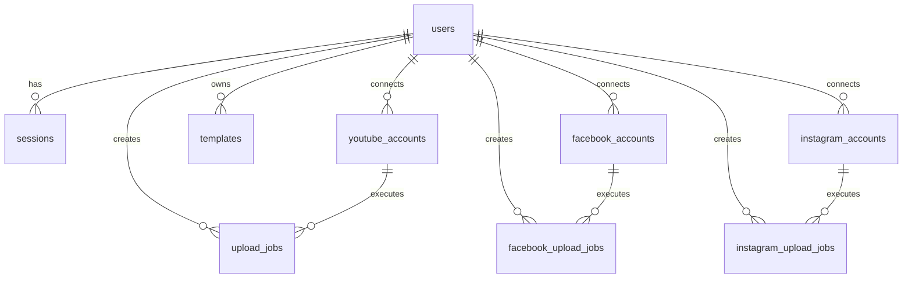

# 🎬 Local Video Clip Editor & Social Publishing Automation Studio

[](https://react.dev/)
[](https://vitejs.dev/)
[](https://tailwindcss.com/)
[](https://workers.cloudflare.com/)
[](https://developers.cloudflare.com/d1/)
[](https://hono.dev/)
[](https://www.backblaze.com/cloud-storage)
[](LICENSE)

> **A high-performance, privacy-first local video editing, reframing, and multi-platform automated social publishing studio.**
> Edit, reframe, split, brand, enhance, and render clips **100% locally in your browser** using WebCodecs hardware acceleration, with serverless scheduled publishing for **YouTube Shorts**, **Facebook Reels**, and **Instagram Reels**.

---

## 📑 Table of Contents

- [🌟 Core System Highlights](#-core-system-highlights)
- [🏗️ System Architecture](#-system-architecture)
- [✨ Existing Features & Capabilities](#-existing-features--capabilities)
  - [1. 100% In-Browser Video Processing Engine](#1-100-in-browser-video-processing-engine)
  - [2. Timeline, Multi-Segment Slicing & Cut Preservation](#2-timeline-multi-segment-slicing--cut-preservation)
  - [3. Dynamic Framing, Aspect Ratios & AI Face Detection](#3-dynamic-framing-aspect-ratios--ai-face-detection)
  - [4. Visual Effects & Background Backdrops](#4-visual-effects--background-backdrops)
  - [5. Typography, Dynamic Part Tokens & Watermarking](#5-typography-dynamic-part-tokens--watermarking)
  - [6. Multi-Track Audio Mixing & Voice Ducking](#6-multi-track-audio-mixing--voice-ducking)
  - [7. Studio Template Presets](#7-studio-template-presets)
  - [8. Responsive Mobile & Desktop Layout](#8-responsive-mobile--desktop-layout)
  - [9. Multi-Platform Social Publishing & Scheduling](#9-multi-platform-social-publishing--scheduling)
  - [10. 1-Minute Cloudflare Cron Engine & Shared B2 Bridge](#10-1-minute-cloudflare-cron-engine--shared-b2-bridge)
- [📁 Project Directory Structure](#-project-directory-structure)
- [🗄️ Database Schema (Cloudflare D1 SQLite)](#-database-schema-cloudflare-d1-sqlite)
- [🌐 Complete Backend REST API Reference](#-complete-backend-rest-api-reference)
  - [1. System Health & Authentication (`/api/health`, `/api/auth/*`)](#1-system-health--authentication-apihealth-apiauth)
  - [2. YouTube OAuth & Uploads (`/api/youtube/*`, `/api/uploads/*`)](#2-youtube-oauth--uploads-apiyoutube-apiuploads)
  - [3. Facebook Meta Graph API (`/api/facebook/*`)](#3-facebook-meta-graph-api-apifacebook)
  - [4. Instagram Graph API (`/api/instagram/*`)](#4-instagram-graph-api-apiinstagram)
  - [5. Social Scheduling & History Center (`/api/social/*`, `/api/history/*`)](#5-social-scheduling--history-center-apisocial-apihistory)
  - [6. Studio Templates Presets (`/api/templates/*`)](#6-studio-templates-presets-apitemplates)
  - [7. Backblaze B2 & Database Storage Management (`/api/storage/*`, `/api/user/storage`)](#7-backblaze-b2--database-storage-management-apistorage-apiuserstorage)
  - [8. Scheduler Triggers & Maintenance (`/api/scheduler/*`, `/api/admin/*`)](#8-scheduler-triggers--maintenance-apischeduler-apiadmin)
- [⚙️ Prerequisites & Environment Configuration](#-prerequisites--environment-configuration)
- [💻 Local Development Setup](#-local-development-setup)
- [🧪 Automated Test Suite](#-automated-test-suite)
- [🚢 Production Deployment Guide](#-production-deployment-guide)
- [🛡️ Security, Privacy & Lifecycle Model](#-security-privacy--lifecycle-model)
- [📄 License](#-license)

---

## 🌟 Core System Highlights

- **🔒 100% In-Browser Local Processing:** Source video files, frames, and audio tracks are decoded and processed locally on your device. Video content is never sent to external servers for editing.
- **⚡ WebCodecs Hardware Acceleration:** Uses native browser `VideoEncoder` (H.264) paired with a built-in zero-dependency MP4 Muxer (`mp4Muxer.js`) for rapid rendering, with automatic fallback to `MediaRecorder`.
- **✂️ Non-Destructive Slicing & Cut Preservation:** Automatically partition long videos by fixed duration (15s, 30s, 60s, 90s) or part count. Mark unwanted segments as cut; the live player dynamically skips cut regions and preserves them during auto-splits.
- **🎯 Dynamic Reframing with AI Face Centering:** Convert widescreen (16:9) footage into vertical formats (9:16, 4:5, 1:1) with fit/fill modes, zoom, pan, and native `FaceDetector` centering.
- **🏷️ Dynamic Token Substitution:** Interpolate `{movie}`, `{part}`, `{total}`, and `{title}` into text overlays, output filenames, YouTube metadata, and social captions.
- **📱 Responsive Single-Column Mobile / Dual-Column Desktop:** Adapts smoothly across phones (< 768px), tablets, and desktops (>= 1024px) with minimum 44px touch targets on mobile playback controls.
- **🌐 3-Platform Social Automation:**
  - **YouTube:** Direct resumable browser-to-YouTube upload session creation with metadata templates and scheduling.
  - **Facebook:** Meta Graph API v26.0 integration with automatic Page discovery, Reels publishing, and Page Video support.
  - **Instagram:** Instagram Creator/Business account publishing and container polling.
- **📦 Single-Upload Shared B2 Bridge:** When scheduling the same video to both Facebook and Instagram, the video is uploaded **only once** to Backblaze B2. Both platforms share the public URL with mutual retention checks (`isB2FileNeededByOtherJobs`) before deleting.
- **⏰ 1-Minute Cron Trigger:** Cloudflare Worker cron runs every minute to execute due posts, verify container statuses, and purge temporary B2 files.

---

## 🏗️ System Architecture

```
┌──────────────────────────────────────────────────────────────────────────────────────────┐
│                                FRONTEND (React 19 + Vite 6)                              │
│                                                                                          │
│  ┌──────────────────────┐  ┌──────────────────────┐  ┌─────────────────────────────────┐ │
│  │   Video Preview      │  │   Timeline & Slicing │  │   EditorTabs (13 Real Tabs)     │ │
│  │   - 9:16 / Custom    │  │   - 15s/30s/60s/90s  │  │   - Split & Cut, Crop, Backdrop │ │
│  │   - 44px Touch Bar   │  │   - Magnetic Snap    │  │   - Text, Logo, Effects, Audio  │ │
│  │   - Draggable Layers │  │   - Cut-Skip Engine  │  │   - Export, YouTube, FB, IG, DB │ │
│  └──────────────────────┘  └──────────────────────┘  └─────────────────────────────────┘ │
│                                                                                          │
│  ┌─────────────────────────────────────────────────────────────────────────────────────┐ │
│  │   Queue & Social Center: Render Queue | Scheduled Videos | Social Upload History    │ │
│  │   - Local WebCodecs / MediaRecorder Export Engine & In-Browser MP4 Muxer            │ │
│  │   - Shared Single-Upload B2 Deduplication & 1-Tap Multi-Platform Publishing        │ │
│  └─────────────────────────────────────────────────────────────────────────────────────┘ │
└────────────────────────────────────────┬─────────────────────────────────────────────────┘
                                         │  HTTPS / REST / Session Tokens / Bearer Auth
┌────────────────────────────────────────▼─────────────────────────────────────────────────┐
│                           BACKEND (Cloudflare Worker + Hono v4)                          │
│                                                                                          │
│  ├── /api/auth/*         -> Multi-device auth, salted PBKDF2 hashing, session tokens    │
│  ├── /api/youtube/*      -> Google OAuth 2.0, Channel Info, Resumable Session Metadata   │
│  ├── /api/facebook/*     -> Meta Graph API v26.0, Page Tokens, Reels Direct/Schedule     │
│  ├── /api/instagram/*    -> Instagram Creator/Business Graph API, Container Publisher    │
│  ├── /api/social/*       -> Active scheduled jobs, upload history, preview URLs, cancel  │
│  ├── /api/storage/*      -> Backblaze B2 Native v3 Authorized Bridge & signed endpoints │
│  ├── /api/templates/*    -> Cloud sync for branding, typography & social metadata        │
│  ├── /api/admin/*        -> Maintenance, scope purges, and automated factory reset       │
│  └── 1-Minute Cron       -> Runs every 1 min: Publishes due FB/IG jobs & cleans B2 files │
└───────────────────┬───────────────────────────────────────────────┬──────────────────────┘
                    │                                               │
┌───────────────────▼──────────────────────┐   ┌────────────────────▼─────────────────────┐
│       DATABASE (Cloudflare D1 SQL)       │   │        CLOUD STORAGE (Backblaze B2)      │
│  - users & sessions                      │   │  - Temporary bridge for Meta Ingestion   │
│  - youtube_accounts & upload_jobs        │   │  - Shared upload reuse across FB & IG    │
│  - facebook_accounts & upload_jobs       │   │  - Mutual retention until both jobs done │
│  - instagram_accounts & upload_jobs      │   │  - Auto-cleaned by 1-min Worker Cron     │
│  - studio templates & metadata presets   │   └──────────────────────────────────────────┘
└──────────────────────────────────────────┘
```

---

## ✨ Existing Features & Capabilities

### 1. 100% In-Browser Video Processing Engine
- **Hardware-Accelerated WebCodecs Pipeline:** Encodes frames using the browser's native `VideoEncoder` (H.264) and GPU acceleration.
- **Custom In-Memory MP4 Muxer (`mp4Muxer.js`):** Built-in zero-dependency ISOBMFF box writer (`ftyp`, `moov`, `trak`, `mdia`, `minf`, `stbl`, `mdat`) outputting fast-start MP4 containers.
- **Automatic MediaRecorder Fallback:** Seamlessly detects browser capability via `capabilityDetector.js` and falls back to a canvas stream recorder if WebCodecs is unavailable.
- **Hardware Concurrency Safeguards:** Automatically caps active parallel render threads according to available CPU cores and memory.

### 2. Timeline, Multi-Segment Slicing & Cut Preservation
- **Visual Playhead & Scrubbing:** Scrubber with magnetic snap within 0.35s of existing cut boundaries.
- **Splitting Presets & Modes:**
  - *By Duration:* 15s (Reels), 30s (TikTok), 60s (Shorts), 90s, or custom seconds.
  - *By Part Count:* Automatically partition timeline into $N$ equal parts.
  - *Manual Split at Playhead:* Hotkey-capable playhead splitting.
- **Smart Cut Preservation:** When enabled, re-splitting preserves all marked cut/deleted sections and only divides kept content.
- **Interactive Parts Table:** Re-order, preview, rename, and individually export or delete segments.

### 3. Dynamic Framing, Aspect Ratios & AI Face Detection
- **Aspect Ratio Presets:** 9:16 (Vertical Shorts/Reels), 16:9 (Landscape), 1:1 (Square), 4:5 (Portrait), and custom ratios.
- **Framing Modes:** Fit (letterbox), Fill (crop), Zoom ($1\times$ to $3\times$), and 2D pan shifting ($X/Y$).
- **Local AI Face Detection (`faceDetectionService.js`):** Uses the native browser `FaceDetector` API with skin-tone luminance heuristic fallback to center detected subjects in vertical crops.

### 4. Visual Effects & Background Backdrops
- **Ambient Blurred Backdrops:** Fill letterbox bars with a blurred duplicate of the source video with configurable blur ($0\text{--}50\text{px}$) and brightness/opacity.
- **Solid Colors & Custom Images:** Choose custom hex backdrop colors or upload background image files.
- **Shader Filters (`webglEffectsPipeline.js`):** GPU-accelerated adjustments for Brightness, Contrast, Saturation, Sepia, Grayscale, Invert, and Fade Alpha.

### 5. Typography, Dynamic Part Tokens & Watermarking
- **Draggable Text Overlays:** Free-form dragging or preset positions (Top-Center, Bottom-Center, etc.).
- **Dynamic Token Interpolation:** Real-time variable replacement:
  - `{movie}` $\rightarrow$ Movie or Series Name
  - `{part}` $\rightarrow$ Sequential Part Number (e.g., `1`, `01`)
  - `{total}` $\rightarrow$ Total Generated Parts Count
  - `{title}` $\rightarrow$ Clip title
- **Styling:** Custom fonts, font sizes, stroke outline thickness/color, background pill boxes, and drop shadows.
- **Logo & Watermark:** Upload custom PNG/JPEG logos with opacity, scale, and anchor positioning.

### 6. Multi-Track Audio Mixing & Voice Ducking
- **Web Audio API Engine (`audioEngine.js`):** Offline audio context graph rendering at 48kHz.
- **Multi-Track Mixing:** Blend original video audio with supplementary background music or voiceover tracks.
- **Auto-Ducking:** Automatically lowers background music volume when voiceover audio is active.
- **Speed & Volume:** Adjust master playback speed ($0.5\times$ to $2.0\times$) and volume levels.

### 7. Studio Template Presets
- **1-Click Presets:** Save text settings, logo settings, YouTube templates, Facebook copy, and Instagram hashtags as reusable presets.
- **Cloud & Local Sync:** Presets persist locally and sync across devices via Cloudflare D1.

### 8. Responsive Mobile & Desktop Layout
- **Mobile (< 768px):** Strict single-column layout prioritized for mobile editing:
  1. Header (Branding, Templates, Change Video, Account)
  2. Video Preview (centered, 9:16 adaptive, no stretching)
  3. Playback Controls (Play/Pause, Restart, Mute, Split, Cut/Keep with min 44px touch targets)
  4. Timeline (widened drag handles `w-8`, collapsible parts timings table)
  5. Editing Controls (`EditorTabs` with horizontal scrolling across all 13 real tabs)
  6. Export & Social Controls (directly selectable in `EditorTabs`)
  7. Secondary Panels (Queue Center collapsible toggle button to prevent excessive scroll)
- **Desktop (>= 1024px):** 2-column workstation layout (`lg:grid-cols-12`) with left-column player + timeline, right-column `EditorTabs`, and bottom Queue Center.

### 9. Multi-Platform Social Publishing & Scheduling
- **YouTube Shorts & Videos:**
  - Google OAuth 2.0 with server-side token refresh.
  - Direct resumable upload session creation (`POST /api/uploads/metadata`) allowing direct browser-to-Google uploads.
  - Scheduled releases, tags, description, category, and Made for Kids configuration.
- **Facebook Reels & Page Videos:**
  - Meta Graph API v26.0 OAuth with Page Access Token auto-exchange and multi-page switching.
  - Direct posting or scheduled posting via Backblaze B2 staging bridge.
- **Instagram Reels:**
  - Meta Graph API Instagram Creator/Business integration.
  - Container creation, status polling, and automatic publishing.
- **3-Section Queue Center:**
  - **Section 1: Scheduled Videos:** View waiting jobs, preview via ephemeral B2 URL, or cancel.
  - **Section 2: Upload History:** View published, failed, and cancelled posts with permalinks.
  - **Section 3: Safe Clear History:** Purge completed logs without deleting active schedules.

### 10. 1-Minute Cloudflare Cron Engine & Shared B2 Bridge
- **Single-Upload Shared B2 Cache:** When scheduling a clip for both Facebook and Instagram, the video file is uploaded only once to Backblaze B2. Both platform jobs share that public URL.
- **Mutual Retention Checks (`isB2FileNeededByOtherJobs`):** When Facebook finishes publishing, it verifies whether Instagram still needs the B2 file before deleting it. The file is purged only when both jobs complete.
- **1-Minute Cron Trigger (`* * * * *`):** Cloudflare Worker cron polls pending jobs every minute, publishes due items, and cleans up orphaned B2 assets.

---

## 📁 Project Directory Structure

```
local-video-clip-editor/
├── backend/                              # Cloudflare Worker Serverless Backend
│   ├── migrations/                       # D1 Database SQL Migrations
│   ├── src/
│   │   ├── auth.js                       # Google OAuth 2.0 & Session token routines
│   │   ├── b2.js                         # Backblaze B2 Native API v3 client
│   │   ├── crypto.js                     # Password hashing (PBKDF2/SHA-256), encryption
│   │   ├── db.js                         # D1 SQLite queries & typed CRUD helpers
│   │   ├── facebook.js                   # Meta Graph API v26.0 Facebook Page & Reels client
│   │   ├── instagram.js                  # Meta Graph API Instagram Business/Creator client
│   │   ├── youtube.js                    # YouTube Data API v3 resumable session helpers
│   │   └── index.js                      # Hono router, REST API & 1-minute Cron Scheduled Handlers
│   ├── .dev.vars.example                 # Backend environment secrets template
│   ├── package.json                      # Backend dependencies (Hono, Wrangler)
│   ├── reset.sql                         # Database reset / purge script
│   ├── schema.sql                        # Complete D1 database schema definitions
│   ├── test_scheduler_suite.mjs          # 40-test automated scheduler test suite
│   └── wrangler.toml                     # Cloudflare Worker configuration & D1 bindings
│
├── frontend/                             # React 19 + Vite Client Application
│   ├── public/                           # Static assets and icons
│   ├── src/
│   │   ├── components/
│   │   │   ├── AudioPanel.jsx            # Multi-track audio mixer & auto-ducking controls
│   │   │   ├── AuthModal.jsx             # User login, registration, and session modal
│   │   │   ├── BackgroundEditor.jsx      # Video blur backdrop, color, and image settings
│   │   │   ├── CropEditor.jsx            # Aspect ratios, crop coordinates & face tracking
│   │   │   ├── EditorTabs.jsx            # Main 13-tab editing & export navigation
│   │   │   ├── EffectsPanel.jsx          # WebGL shader filter adjustments
│   │   │   ├── ExportPanel.jsx           # Render resolution, bitrate, format, and batch export
│   │   │   ├── FacebookPanel.jsx         # Facebook Page selector, copy & scheduling
│   │   │   ├── GeneratedClips.jsx        # Output gallery, 1-tap social publishing, ZIP download
│   │   │   ├── GeneratedVideoPlayer.jsx  # Modal video preview player
│   │   │   ├── Header.jsx                # Responsive header, templates modal trigger, account
│   │   │   ├── InstagramPanel.jsx        # Instagram Creator selector, copy & scheduling
│   │   │   ├── LogoEditor.jsx            # Watermark branding, opacity, and positioning
│   │   │   ├── ProcessingQueue.jsx       # Batch rendering queue & hardware worker stats
│   │   │   ├── ScheduledVideosSection.jsx# Section 1: Scheduled Videos waiting in B2
│   │   │   ├── SocialUploadHistorySection.jsx # Section 2 & 3: History & Safe Clear
│   │   │   ├── SplitCutEditor.jsx        # Duration/parts splitters, cut ranges, parts table
│   │   │   ├── StoragePanel.jsx          # Backblaze B2 storage usage and cleanup stats
│   │   │   ├── StorageSettingsModal.jsx  # Cloud storage & GDPR purge modal
│   │   │   ├── TemplateManagerModal.jsx  # Studio template presets manager
│   │   │   ├── TextEditor.jsx            # Typography, token replacement, and text layers
│   │   │   ├── Timeline.jsx              # Interactive multi-track timeline & cut-skipping
│   │   │   ├── VideoPreview.jsx          # Real-time WYSIWYG canvas & 44px playback controls
│   │   │   ├── VideoUploader.jsx         # Drag-and-drop video upload & metadata probe
│   │   │   ├── YouTubePanel.jsx          # YouTube upload metadata & scheduler
│   │   │   ├── YouTubeScheduleModal.jsx  # Bulk scheduling interval modal
│   │   │   └── YouTubeUploadHistory.jsx  # Legacy YouTube upload job audit logs
│   │   ├── hooks/
│   │   │   ├── useAllUploadHistory.js    # Aggregated YouTube + FB + IG history hook
│   │   │   ├── useAuth.js                # Auth state, login/logout, and session sync
│   │   │   ├── useFacebook.js            # Facebook accounts and scheduled jobs hook
│   │   │   ├── useInstagram.js           # Instagram accounts and scheduled jobs hook
│   │   │   ├── useProcessingQueue.js     # Rendering queue and worker dispatcher
│   │   │   ├── useTemplates.js           # Studio template presets hook
│   │   │   ├── useUploadQueue.js         # Social media upload orchestration
│   │   │   └── useYouTube.js             # YouTube channel and upload jobs hook
│   │   ├── services/
│   │   │   ├── apiService.js             # Client API wrapper for Cloudflare Worker
│   │   │   ├── audioEngine.js            # Web Audio API mixer & offline audio graph
│   │   │   ├── capabilityDetector.js     # Hardware, WebCodecs & CPU core detector
│   │   │   ├── exportEngine.js           # Main export coordinator (WebCodecs & MediaRecorder)
│   │   │   ├── faceDetectionService.js   # Browser-side AI face detection
│   │   │   ├── mp4Muxer.js               # Zero-dependency in-browser MP4 container muxer
│   │   │   ├── sharedUploadCache.js      # Single-upload shared B2 deduplication cache
│   │   │   ├── videoProcessingEngine.js  # Frame-by-frame transformation engine
│   │   │   ├── webglEffectsPipeline.js   # WebGL shader filters
│   │   │   └── zipService.js             # JSZip batch packaging utility
│   │   ├── utils/
│   │   │   ├── crop.js                   # Aspect ratio math and bounding box calculations
│   │   │   ├── filename.js               # Output file naming with token substitution
│   │   │   ├── mediaDetector.js          # Codec & video container inspection
│   │   │   ├── scheduler.js              # Timestamp intervals and timezone formatters
│   │   │   ├── time.js                   # Timecode formatters (HH:MM:SS.mmm)
│   │   │   └── titleCleaner.js           # Video title formatting and cleanup
│   │   ├── App.jsx                       # Unified responsive application root
│   │   ├── index.css                     # Tailwind CSS imports & global styles
│   │   └── main.jsx                      # React 19 application entrypoint
│   ├── package.json                      # Frontend dependencies
│   ├── tsconfig.json                     # TypeScript configuration
│   ├── vite.config.ts                    # Vite build & development proxy configuration
│   └── wrangler.jsonc                    # Cloudflare Pages / Workers static assets config
│
├── package.json                          # Workspace root management scripts
├── README.md                             # Project Documentation
└── architecture.txt                      # Architecture Reference
```

---

## 🗄️ Database Schema (Cloudflare D1 SQLite)

Defined in [`backend/schema.sql`](file:///e:/local-video-clip-editor/backend/schema.sql):



### Table Definitions:
1. **`users`**: `id` (PK), `email` (UNIQUE), `password_hash`, `salt`, `name`, `created_at`, `last_seen`, `updated_at`.
2. **`sessions`**: `id` (PK), `user_id` (FK), `token` (UNIQUE), `created_at`, `expires_at`.
3. **`youtube_accounts`**: `id` (PK), `user_id` (FK), `channel_id`, `channel_title`, `channel_handle`, `channel_thumbnail`, `access_token`, `refresh_token`, `token_expiry`, `scopes`, `created_at`, `updated_at`.
4. **`upload_jobs`**: `id` (PK), `user_id` (FK), `youtube_account_id` (FK), `part_number`, `movie_name`, `title`, `description`, `tags`, `visibility`, `category`, `made_for_kids`, `notify_subscribers`, `scheduled_at`, `status`, `youtube_video_id`, `error_message`, `created_at`, `updated_at`, `published_at`.
5. **`templates`**: `id` (PK), `user_id` (FK), `name`, `description`, `text_data`, `youtube_data`, `facebook_data`, `instagram_data`, `logo_data`, `created_at`, `updated_at`.
6. **`facebook_accounts`**: `id` (PK), `user_id` (FK), `fb_user_id`, `fb_user_name`, `page_id`, `page_name`, `page_category`, `page_thumbnail`, `page_access_token`, `user_access_token`, `available_pages`, `created_at`, `updated_at`.
7. **`facebook_upload_jobs`**: `id` (PK), `user_id` (FK), `facebook_account_id` (FK), `page_id`, `content_type`, `title`, `caption`, `description`, `hashtags`, `scheduled_at`, `status`, `b2_file_id`, `b2_file_name`, `facebook_video_id`, `facebook_post_url`, `error_message`, `created_at`, `updated_at`, `published_at`.
8. **`instagram_accounts`**: `id` (PK), `user_id` (FK), `ig_user_id`, `ig_username`, `ig_name`, `ig_profile_picture_url`, `page_id`, `page_name`, `access_token`, `user_access_token`, `available_accounts`, `created_at`, `updated_at`.
9. **`instagram_upload_jobs`**: `id` (PK), `user_id` (FK), `instagram_account_id` (FK), `ig_user_id`, `content_type`, `title`, `caption`, `description`, `hashtags`, `scheduled_at`, `status`, `b2_file_id`, `b2_file_name`, `instagram_container_id`, `instagram_media_id`, `instagram_post_url`, `error_message`, `created_at`, `updated_at`, `published_at`.

---

## 🌐 Complete Backend REST API Reference

All backend routes are implemented in [`backend/src/index.js`](file:///e:/local-video-clip-editor/backend/src/index.js):

### 1. System Health & Authentication (`/api/health`, `/api/auth/*`)
| Method | Endpoint | Description |
|---|---|---|
| `GET` | `/api/health` | Health check returning status and UTC timestamp |
| `POST` | `/api/auth/signup` | Create user with salted PBKDF2 password hash |
| `POST` | `/api/auth/login` | Authenticate credentials and return session token |
| `GET` | `/api/auth/me` | Fetch active user profile and connected accounts |
| `POST` | `/api/auth/logout` | Invalidate and delete active session token |

### 2. YouTube OAuth & Uploads (`/api/youtube/*`, `/api/uploads/*`)
| Method | Endpoint | Description |
|---|---|---|
| `GET` | `/api/youtube/connect` | Initiates Google OAuth 2.0 flow |
| `GET` | `/api/youtube/callback` | OAuth redirect callback; exchanges authorization code for tokens |
| `GET` | `/api/youtube/account` | Fetch connected YouTube channel details |
| `POST` | `/api/youtube/disconnect` | Revoke YouTube access and delete account record |
| `POST` | `/api/uploads/metadata` | Create upload job record and obtain YouTube Resumable Upload URL |
| `GET` | `/api/uploads` | List YouTube upload jobs |
| `PUT` | `/api/uploads/:id` | Update YouTube job status, video ID, or error message |
| `POST` | `/api/uploads/:id/retry` | Reset failed YouTube upload job for retry |

### 3. Facebook Meta Graph API (`/api/facebook/*`)
| Method | Endpoint | Description |
|---|---|---|
| `GET` | `/api/facebook/connect` | Initiates Meta OAuth flow with Page publishing permissions |
| `GET` | `/api/facebook/callback` | OAuth redirect callback; exchanges code for Page tokens |
| `GET` | `/api/facebook/account` | Fetch connected Facebook account and managed Pages list |
| `GET` | `/api/facebook/debug-page` | Safe diagnostics check on active Facebook Page permissions |
| `POST` | `/api/facebook/connect-page-id` | Connect a Facebook Page directly by Page ID |
| `POST` | `/api/facebook/select-page` | Switch active Facebook Page for publishing |
| `POST` | `/api/facebook/disconnect` | Disconnect Facebook integration and clear credentials |
| `POST` | `/api/facebook/b2/upload-url` | Obtain presigned Backblaze B2 upload target for Facebook Reels |
| `POST` | `/api/facebook/publish` | Ingest and publish/schedule Facebook Reel or Page Video |
| `GET` | `/api/facebook/jobs` | Fetch Facebook publishing history and scheduled queue |
| `GET` | `/api/facebook/jobs/:id` | Fetch details for a specific Facebook job |

### 4. Instagram Graph API (`/api/instagram/*`)
| Method | Endpoint | Description |
|---|---|---|
| `GET` | `/api/instagram/connect` | Initiates Meta OAuth flow with Instagram Business scopes |
| `GET` | `/api/instagram/callback` | OAuth redirect callback; exchanges code for IG Creator tokens |
| `GET` | `/api/instagram/account` | Fetch linked Instagram Creator / Business accounts |
| `GET` | `/api/instagram/debug-account` | Safe diagnostics check on active Instagram account |
| `GET` | `/api/instagram/diagnostics` | Diagnostic inspection of Instagram publishing capability |
| `POST` | `/api/instagram/connect-account-id` | Connect an Instagram Account by Account ID |
| `POST` | `/api/instagram/select-account` | Switch active Instagram account destination |
| `POST` | `/api/instagram/disconnect` | Disconnect Instagram integration |
| `POST` | `/api/instagram/b2/upload-url` | Obtain presigned Backblaze B2 upload target for Instagram Reels |
| `POST` | `/api/instagram/publish` | Ingest and publish/schedule Instagram Reel |
| `GET` | `/api/instagram/jobs` | List Instagram post history and scheduled queue |
| `GET` | `/api/instagram/jobs/:id` | Fetch details for a specific Instagram job |

### 5. Social Scheduling & History Center (`/api/social/*`, `/api/history/*`)
| Method | Endpoint | Description |
|---|---|---|
| `GET` | `/api/social/scheduled` | **Section 1:** List all active scheduled jobs waiting in B2 for FB and IG |
| `GET` | `/api/social/history` | **Section 2:** List completed publishing history (`published`, `failed`, `cancelled`) |
| `GET` | `/api/social/preview-url` | Generate temporary signed B2 preview URL for a scheduled video |
| `POST` | `/api/social/cancel` | Cancel an active scheduled job with multi-platform B2 retention check |
| `POST` | `/api/social/history/clear` | **Section 3:** Safely clear completed history without deleting active schedules |
| `GET` | `/api/history/all` | Fetch unified history across YouTube, Facebook, and Instagram |
| `POST` | `/api/history/clear` | Clear platform-specific history (`youtube`, `facebook`, `instagram`, `all`) |

### 6. Studio Templates Presets (`/api/templates/*`)
| Method | Endpoint | Description |
|---|---|---|
| `GET` | `/api/templates` | List all saved studio templates for the authenticated user |
| `GET` | `/api/templates/:id` | Fetch single template preset |
| `POST` | `/api/templates` | Create a new studio template preset |
| `PUT` | `/api/templates/:id` | Update an existing studio template preset |
| `DELETE` | `/api/templates/:id` | Delete a studio template preset |

### 7. Backblaze B2 & Database Storage Management (`/api/storage/*`, `/api/user/storage`)
| Method | Endpoint | Description |
|---|---|---|
| `GET` | `/api/storage/overview` | View B2 bucket files, sizes, and D1 database row metrics |
| `POST` | `/api/storage/b2/delete` | Immediately delete a specific file from Backblaze B2 |
| `POST` | `/api/storage/b2/delete-all` | Purge all temporary files from Backblaze B2 bucket |
| `POST` | `/api/storage/clear-scope` | Clear user records by scope (`history`, `settings`, `all`) |
| `GET` | `/api/user/storage` | Fetch user storage statistics |
| `POST` | `/api/user/storage/clear` | Clear user data by scope (`history`, `settings`, `youtube`, `all`) |

### 8. Scheduler Triggers & Maintenance (`/api/scheduler/*`, `/api/admin/*`)
| Method | Endpoint | Description |
|---|---|---|
| `POST` | `/api/scheduler/run` | Manually run scheduled publishing cycle for due FB & IG jobs |
| `POST` | `/api/facebook/process-scheduled`| Process due Facebook scheduled posts |
| `POST` | `/api/instagram/process-scheduled`| Process due Instagram scheduled posts and poll containers |
| `POST` | `/api/admin/cleanup` | Run database vacuum, clear expired sessions, and purge orphaned B2 files |

---

## ⚙️ Prerequisites & Environment Configuration

### Prerequisites
- **Node.js:** v18.0.0 or higher
- **Cloudflare Account:** For Workers and D1 Database
- **Wrangler CLI:** Included as a dev dependency (`npx wrangler`)
- **Google Cloud Console App:** For YouTube Data API v3 OAuth
- **Meta for Developers App:** For Facebook Pages & Instagram Graph API
- **Backblaze B2 Account:** For temporary staging bridge

---

### Environment Configuration

#### 1. Backend (`backend/wrangler.toml` & Secrets)

```toml
# backend/wrangler.toml
name = "local-video-clip-editor-worker"
main = "src/index.js"
compatibility_date = "2024-09-23"
compatibility_flags = ["nodejs_compat"]

[[d1_databases]]
binding = "DB"
database_name = "videoclip-db"
database_id = "your-d1-database-id"
migrations_dir = "migrations"

[vars]
GOOGLE_CLIENT_ID = "your-google-client-id.apps.googleusercontent.com"
APP_URL = "http://localhost:8787"                # Worker URL
FRONTEND_URL = "http://localhost:5173"           # Frontend URL
FACEBOOK_APP_ID = "your-facebook-app-id"
META_GRAPH_API_VERSION = "v26.0"
B2_BUCKET_NAME = "your-b2-bucket-name"
B2_BUCKET_ID = "your-b2-bucket-id"

[triggers]
crons = ["* * * * *"]                           # Runs every 1 minute
```

Set production secrets in Cloudflare:
```bash
npx wrangler secret put GOOGLE_CLIENT_SECRET
npx wrangler secret put FACEBOOK_APP_SECRET
npx wrangler secret put B2_KEY_ID
npx wrangler secret put B2_APPLICATION_KEY
```

For local backend development, place secrets in `backend/.dev.vars`:
```ini
GOOGLE_CLIENT_SECRET="your-google-client-secret"
FACEBOOK_APP_SECRET="your-facebook-app-secret"
B2_KEY_ID="your-b2-key-id"
B2_APPLICATION_KEY="your-b2-application-key"
```

#### 2. Frontend (`frontend/.env`)

```ini
# frontend/.env
VITE_API_URL="https://local-video-clip-editor-worker.yourname.workers.dev"
```

---

## 💻 Local Development Setup

### 1. Clone & Install Dependencies

```bash
git clone https://github.com/Abhishek-64/local-video-clip-editor.git
cd local-video-clip-editor

npm install
cd frontend && npm install && cd ..
cd backend && npm install && cd ..
```

### 2. Initialize Local D1 Database

```bash
cd backend
npx wrangler d1 execute videoclip-db --local --file=schema.sql -c wrangler.toml
cd ..
```

### 3. Start Development Servers

**Backend (Terminal 1):**
```bash
npm run dev:backend
# Starts Hono server at http://localhost:8787
```

**Frontend (Terminal 2):**
```bash
npm run dev:frontend
# Starts Vite at http://localhost:5173
```

---

## 🧪 Automated Test Suite

The project includes automated test suites covering database transactions, scheduling, atomic claims, and shared B2 file retention:

```bash
# Run the 40-test scheduler & publishing suite:
node backend/test_scheduler_suite.mjs
```

**Test Coverage Highlights:**
- UTC timestamp normalization across ISO formats and timezones.
- Independent schedule creation and execution for Facebook vs Instagram.
- Atomic worker claims preventing duplicate posting races.
- Idempotency protection on repeated submissions.
- Multi-tick Instagram container polling.
- Strict separation of Section 1 (Scheduled Videos) from Section 2 (History).
- Safe history clearing protecting active scheduled jobs.
- Shared B2 file retention across multiple platform schedules.

---

## 🚢 Production Deployment Guide

### Deploy Database Schema:
```bash
cd backend
npx wrangler d1 execute videoclip-db --remote --file=schema.sql -c wrangler.toml
```

### Deploy Backend Worker:
```bash
cd backend
npm run deploy
```

### Deploy Frontend:
```bash
cd frontend
npm run deploy
```

Or deploy both from root:
```bash
npm run deploy:all
```

---

## 🛡️ Security, Privacy & Lifecycle Model

1. **Client-Side Video Isolation:** Video decoding, transformation, and encoding occur entirely in the browser memory (`Blob`, `ArrayBuffer`, `VideoFrame`). Video frames are never uploaded to the backend server for processing.
2. **Ephemeral Cloud Storage Lifecycle:** When publishing to Meta platforms, video files are uploaded directly to Backblaze B2 using authorized presigned URLs. Files are retained only while jobs remain scheduled and are deleted once published.
3. **Encrypted Credentials & Session Security:** User passwords use salted PBKDF2/SHA-256. Google and Meta access tokens are encrypted server-side and stored in Cloudflare D1.

---

## 📄 License

This project is licensed under the [MIT License](LICENSE).
